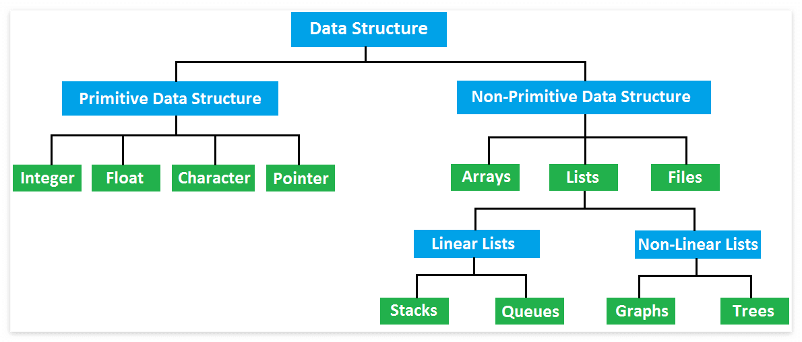

# 데이터 자료구조(Data Structure)란?

---
<p align="center">

</p>

---

<br>

## 자료구조란?
자료 구조하면 흔한 자료구조의 형태로 큐(Queue)나 스택(Stack) 혹인 연결 리스트(Linked List), 트리(Tree) 등을 떠올리거나 선택 정렬, 삽입 정렬 등등의 정렬 알고리즘 등이 먼저 떠오를 것이다. 

자료구조의 사전적인 의미로는 자료(Data)들의 집합을 의미하며, 각 원소들이 논리적으로 정의된 규칙에 의해 나열되며 자료에 대한 처리를 효율적으로 수행할 수 있도록 자료를 구분하여 표현한 것이다. 즉, 여러 데이터들의 묶음을 저장하고, 사용하는 방법을 정의한 것이다.

<br>

## 자료 구조와 알고리즘의 관계
Algorithm(알고리즘)은 어떤 문제를 해결하기 위해 정해진 일련의 절차나 방법을 공식화한 형태로 표현한 것이다. 즉 문제 풀이에 필요한 계산 절차 또는 처리 과정의 순서이다. 알고리즘의 중요한 특징은 그 알고리즘을 보고 누구나 같은 결과를 낼 수 있어야 한다. 보통 자료 구조가 선택되면 그에 적용할 알고리즘은 거의 명확해진다. 즉, 자료 구조가 효율적인 알고리즘을 사용할 수 있게 함으로 자료 구조와 알고리즘은 매우 밀접한 관계를 갖는다. 

또한 알고리즘을 프로그램 명령어들의 집합이라고도 한다. 프로그램은 특정 문제를 해결하기 위한 처리 방법과 순서를 기록한 명령어들의 모음이다. 이 프로그램이 실행되기 위해서는 메모리에 올릴 데이터가 필요하며 이 데이터들을 담아내는 방식은 자료구조이다.

```
자료구조 + 알고리즘(+a) = 프로그램
```

<br>

## 데이터(Data)란?
* 데이터는 문자, 숫자, 소리, 그림, 영상 등 실생활을 구성하고 있는 모든 값이다.
* 데이터는 그 자체만으로 어떤 정보를 가지기 힘들다.
* 데이터는 분석하고 정리하여 활용해야만 의미를 가질 수 있다.
* 데이터를 사용하려는 목적에 따라 형태를 구분하고, 분류하여 사용한다.
* 필요에 따라 데이터의 특징을 잘 파악(분석)하여 정리하고, 활용해야 한다.
  * 데이터를 정해진 규칙없이 저장하거나, 하나의 구조로만 정리하고 활용하는 것보다 데이터를 체계적으로 정리하여 저장해두는 것이 데이터를 활용하는 데 있어 훨씬 유리하다.

<br>

## 자료구조를 배우는 이유
* 데이터를 체계적으로 저장하고, 효율적으로 활용하기 위해서 자료구조를 사용한다.
* 대부분의 자료구조는 특정한 상황에 놓인 문제를 해결하는 데에 특화되어 있다.
* 많은 자료구조를 알아두면 특정 문제를 해결하는 데에 상황에 가장 적합한 자료구조를 빠르게 찾아 데이터를 정리하고 활용하여 문제를 빠르고 정확하게 해결할 수 있다.
* 이것은 문제 해결 능력을 필요로하는 알고리즘과 굉장히 밀접한 연관성이 있다.
* 결국 문제해결을 하기 위해서 배운다.
* 자료를 더 효율적으로 저장하고, 관리하기 위해 사용하며 잘 선택된 자료구조는 실행시간을 단축시켜주거나 메모리 용량의 절약을 이끌어 낼 수 있다.

<br>

## 자료구조의 특징
1. 효율성
2. 추상화
    * 추상화란 복잡한 자료, 모듈, 시스템 등으로부터 핵심적인 개념만 간추려 내는 것이다. 자료구조를 구현할 때 중요한 것은 어느 시점에 데이터를 삽입할 것이며, 어느 시점에 이러한 데이터를 어떻게 사용할 것인지에 대해서 초점을 맞출 수 있기 때문에 구현 외적인 부분에 더 시간을 쏟을 수 있는 것이고 알고리즘 자체에는 중점을 두지 않는다. 마찬가지로 자료구조 내부의 구현은 중요하지 않다. 어떻게 구현했는지보다 어떻게 사용해야 하는 지를 알고 있어야 한다. 
3. 재사용성
    * 자료구조를 설계할 때 특정 프로그램에서만 동작하게 설계하지는 않는다. 다양한 프로그램에서 동작할 수 있도록 범용성 있게 설계하기 때문에 해당 프로젝트가 아닌 다른 프로젝트에서도 사용할 수 있다. 

<br>

## 자료구조의 분류


<br>

## 개발자라면 알아야 할 필수 자료 구조
* <https://velog.io/@jha0402/Data-structure-개발자라면-꼭-알아야-할-7가지-자료구조>
* <https://bnzn2426.tistory.com/115>


### 이미 정해진 것들을 컴퓨터가 자동으로 실행하게 끔 추상화시키는 것이 개발자가 하는 중요한 것!!!
* 자료형을 무엇을 쓸 것인가
* 어떠한 프로세스를 사용할 것인가
* 프로세스에 어떤 알고리즘을 사용할 것인가
* 어떤 구조 또는 디자인 패턴을 사용할 것인가

<br>

## :zap: 참조
* <https://bnzn2426.tistory.com/115>
* <https://hanamon.kr/자료구조란-자료구조를-배우는-이유>
* <https://andrew0409.tistory.com/148>

<br>
