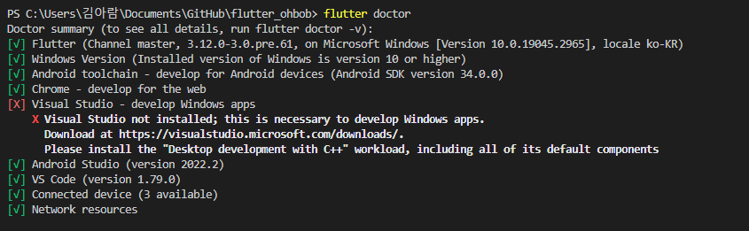

# 플러터 프로젝트 시작하기

---

---

 

## 필요한 프로그램 
<https://flutter.dev/>
### 플러터 SDK <https://docs.flutter.dev/get-started/install>
### vsCode 설치 <https://code.visualstudio.com/Download>
### 안드로이스 스튜디오 설치 <https://developer.android.com/studio>

 

## 플러터 설치 및 프로젝트 준비 완료
Visual Studio Code를 사용할 것이기에 Visual Studio는 따로 설치를 해주지 않았다.

 

## :zap: 참고
### How To Install Flutter For Windows - Build Flutter Apps 1 - [Youtube View](https://www.youtube.com/watch?v=VFDbZk2xhO4&list=PLCC34OHNcOtpx9qCZNv-NbIT1Gx3BAOku&index=1)
  
### First Flutter App On Android - Build Flutter Apps 2 - [Youtube View](https://www.youtube.com/watch?v=p7MkQHfVbcQ&list=PLCC34OHNcOtpx9qCZNv-NbIT1Gx3BAOku&index=2)
* <https://blockdmask.tistory.com/420> -- 플러터와 안드로이드 스튜디오 설치 총정리
* <https://blog.naver.com/mingjooo_/222976806429> -- VSCode에서 Flutter(플러터) 설치
* <https://calvinjmkim.tistory.com/60> - 플러터 설치 및 환경설정 에러 해결
* <https://blog.naver.com/mingjooo_/222976806429> - Android toolchain 등 에러 해결

 
