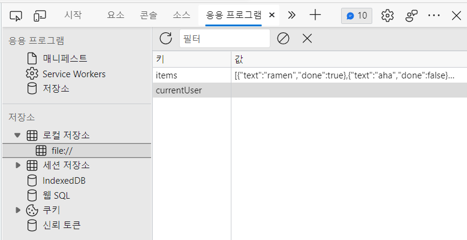
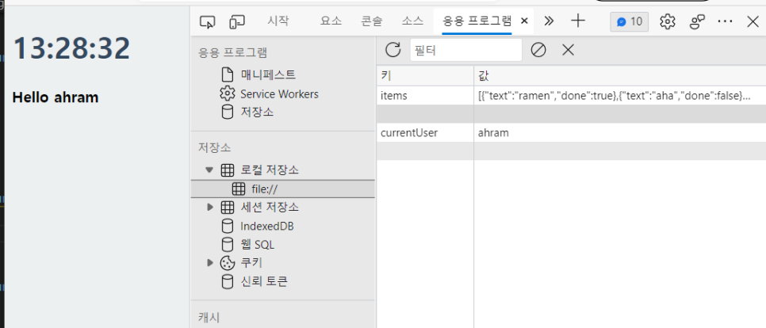
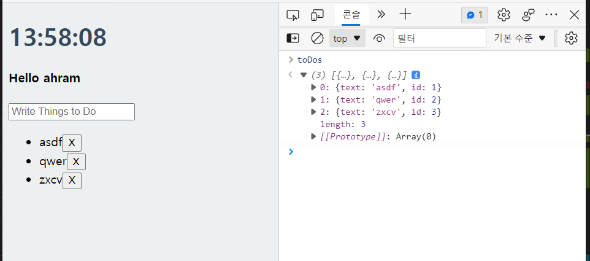
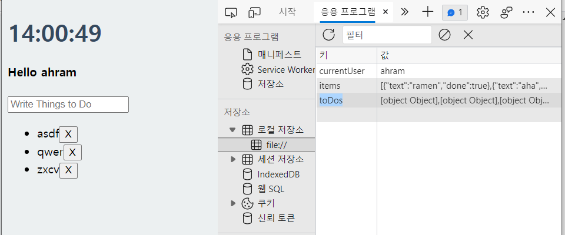
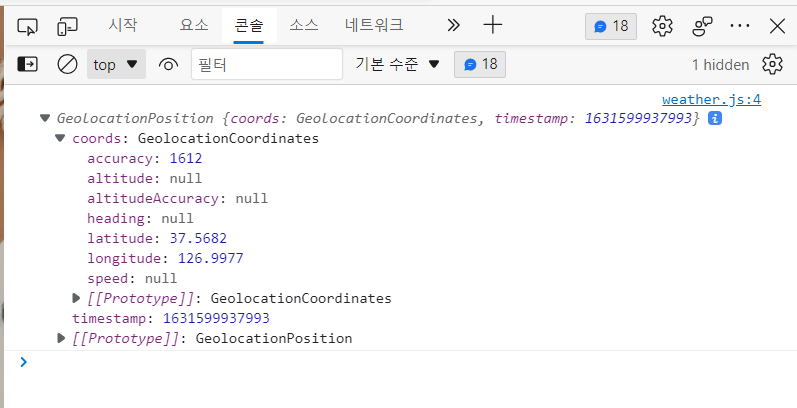
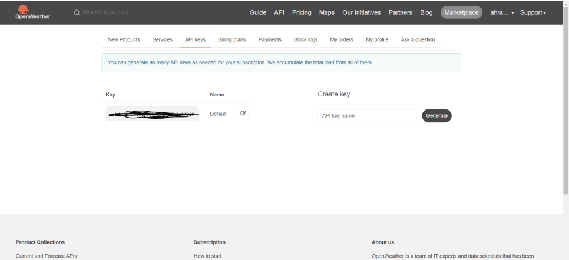
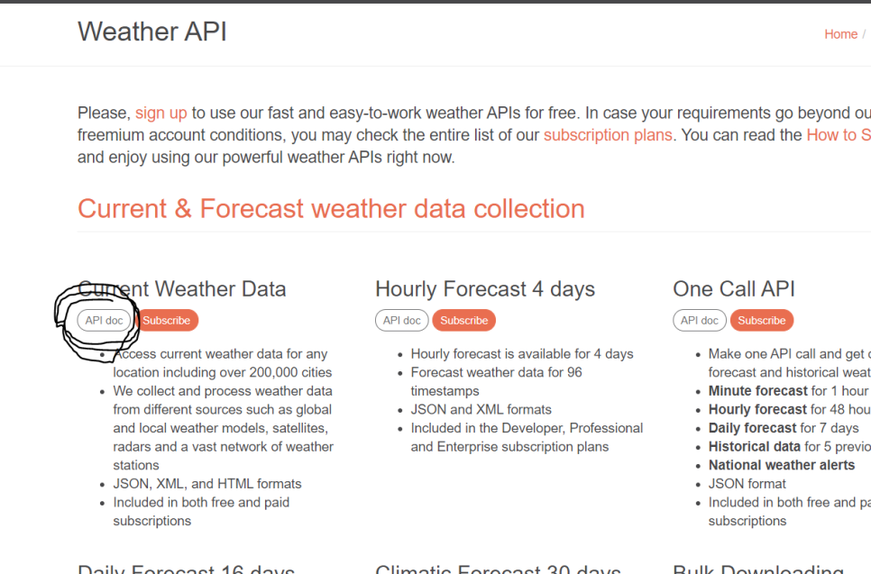
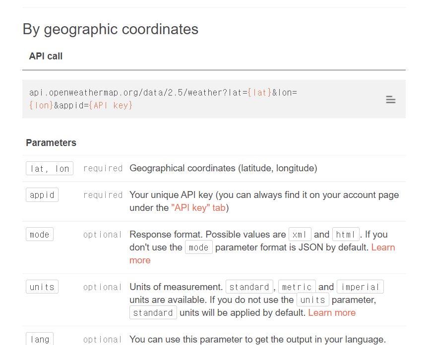

# Nomad Coder : Vanilla JS로 크롬 앱 만들기 #3

---
<p align="center">

</p>

---

<br>

## A clone of the productivity chrome app 'momentom' on Vanilla JS

<https://nomadcoders.co/javascript-for-beginners>

<https://github.com/byahram/2022-webs/tree/main/study/javascript/NomadCoderVanilaJS>

### 3-1. Making a JS Clock part1
```javascript
const date = new Date();        // get a current date
const minutes = date.getMinutes();        // get a minute from current date
const hours = date.getHours();        // get an hour from current date
const seconds = date.getSeconds();        // get a second from current date
```

### 3-2. Making a JS Clock part2
```javascript
setInterval(getTime, 1000);    // getTime을 1000 miliseconds(1초)마다 실행한다.
setTimeout();
```
* 자바스크립트로 주기적인 작업을 실행하기 위해서 setInterval과 setTimeout 메소드를 사용한다.
* setInterval
  * 일정한 시간 간격으로 작업을 수행하기 위해 사용한다.
  * clearInterval을 사용하여 중지한다.
  * 일정한 시간 간격으로 실행되는 작업이 그 시간 간격보다 오래 걸릴 경우 문제가 발생할 수 있다.
* setTimeout
  * 일정한 시간 후에 작업을 한 번 실행한다.
  * 재귀적 호출을 사용하여 작업을 반복한다.
  * 지정된 시간을 기다린 후 작업을 수행하고, 다시 일정한 시간을 기다린 후 작업을 수행한다.
  * clearTImeout을 사용하여 작업을 중지한다.
* If seconds is less than 10, it will show -> 0${seconds)
```javascript
clockTitle.innerText = `${hours}:${minutes}:${seconds < 10 ? `0${seconds}` : seconds}`;
```

### 3-3. Saving the User Name part1

```javascript
// USER_LS의 ITEM을 로컬저장소에서 가져오기
const USER_LS = "currentUser";
const currentUser = localStorage.getItem(USER_LS);
```

### 3-4. Saving the User Name part2

```javascript
localStorage.setItem(USER_LS, text);        // save to localStorage
const currentUser = localStorage.getItem(USER_LS);        // get item info from localStorage
```

### 3-5. Making a To Do List part1
Similar to #3-2, #3-3

### 3-6. Making a To Do List part2

```javascript
const toDoObj = {
        text: text,
        id: toDos.length + 1
};
toDos.push(toDoObj);
```


```javascript
localStorage.setItem(TODOS_LS, JSON.stringify(toDos));
```

* JSON : JavaScript Object Notation의 Abbreviation
* JSON.stringify() : Object를 string으로 바꾸는

### 3-7. Making a To Do List part3
```javascript
return toDo.id !== parseInt(li.id);
```
* toDo.id는 num, li.id는 string -> 둘다 num으로 맞춰준 후 비교

```javascript
const cleanToDos = toDos.filter(function(toDo) {
        console.log(toDo.id, li.id);        // toDo.id는 num, li.id는 string
        return toDo.id !== parseInt(li.id);
});
toDos = cleanToDos;
saveToDos();
```
* 리스트를 삭제한 수 toDos를 대체해주고 저장

### 3-8. Image Background
```javascript
// JAVASCRIPTS

function getRandom() {
    const number = Math.floor(Math.random() * 8);
    return number;
}

function init() {
    const randomNumber = getRandom();
}
```
* get a random number 0 to 8

```css
// CSS

@keyframes fadeIn {
    from {opacity: 0;}
    to {opacity: 1;}
}

.bgImage {
    position: absolute;
    top: 0;
    left: 0;
    width: 100%;
    height: 100%;
    z-index: -1;
    animation: fadeIn 0.5s linear; 
}
```

### 3-9. Getting the Weather part1 - Geolocation
* saveCoords는 currentName(userName), toDos 저장하는 법과 같다.
```javascript
function handleGeoSuccess(position) {
    console.log(position);
}

function handleGeoFailed() {
    console.log('Cant get geo location!!');
}

function askForCoords() {
    // get my current position(location)
    navigator.geolocation.getCurrentPosition(handleGeoSuccess, handleGeoFailed);
}
```


### 3-10. Getting the Weather part2 - API
* Using Open Weather API
  * <https://openweathermap.org/>
* after sign up and sign in, then get a API Keys

* API (Application Programming Interface)는 다른 서버로부터 손쉽게 데이터를 가져올 수 있는 수단이며 오로지 데이터만 가져온다.
* fetch() : 안에는 가져올 데이터가 들어가면 되고, 따옴표가 아닌 backtick(`)을 사용한다

```javascript
fetch(`https://api.openweathermap.org/data/2.5/weather?lat=${lat}&lon=${lon}&appid=${API_KEY}`);
```




```javascript
fetch(
        `http://api.openweathermap.org/data/2.5/weather?lat=${lat}&lon=${lon}&appid=${API_KEY}&units=metric&lang=kr`
)
.then(function(response) {
        return response.json();
})
.then(function(json) {
        const temp = json.main.temp;
        const place = json.name;
        weather.innerHTML = `${temp}˚ at ${place}`;
});
```

* fetch() 함수를 실행한 후 then을 실행한다.

<br>
