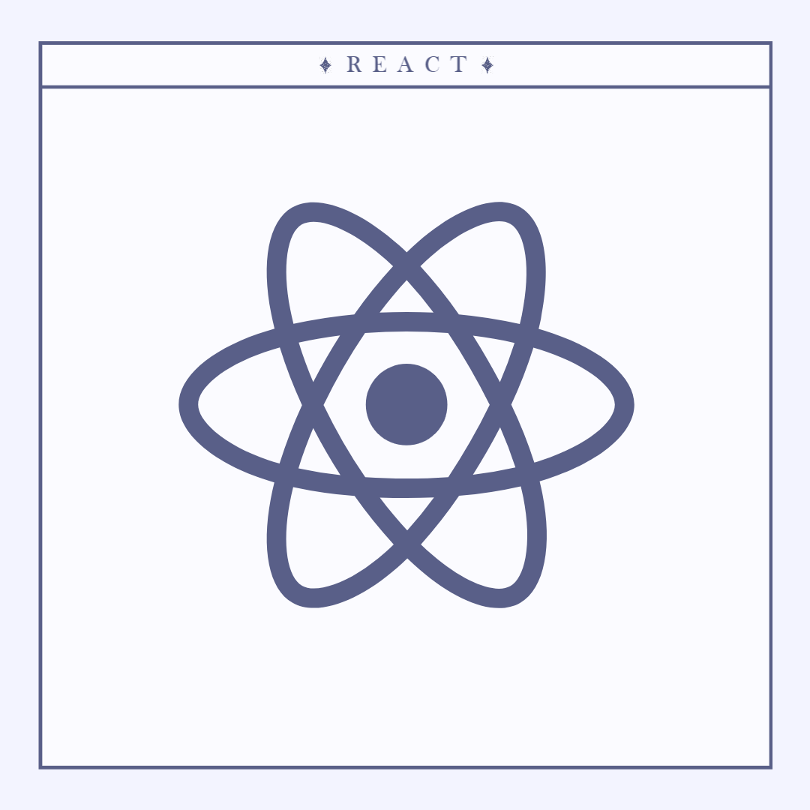
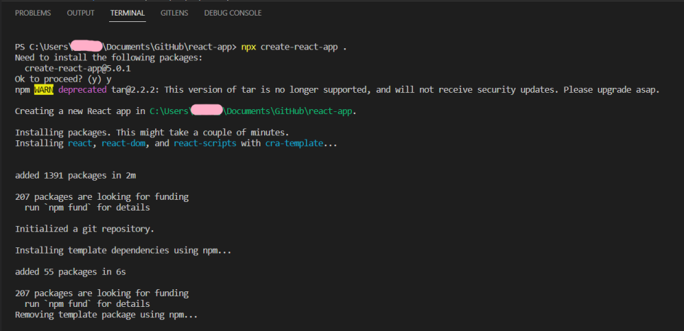
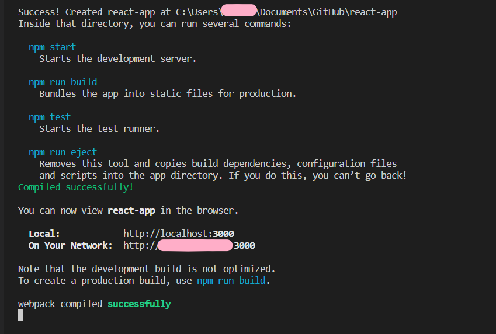
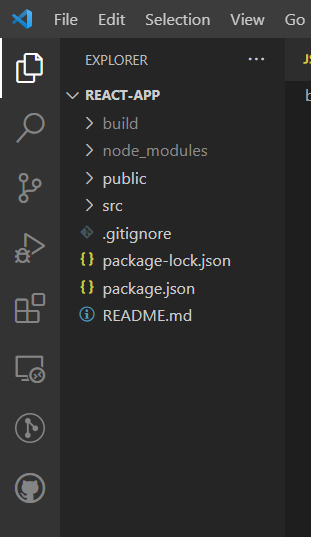
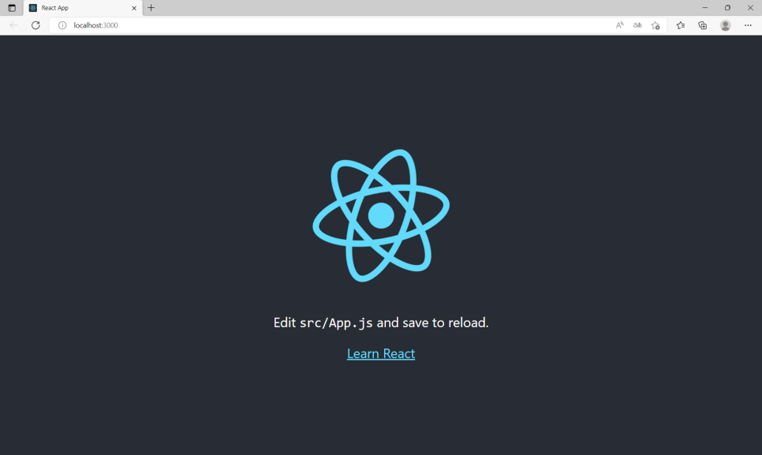

# React 개발 환경 구축 설치하기 with create-react-app

---
<p align="center">

</p>

---

<br>

## 1. 온라인 플레이 그라운드 사용하기
내 컴퓨터에 React 개발 환경을 세팅하지 않고 아래와 같은 온라인 서비스를 이용하는 방법이다.
* <https://codepen.io/>
* <https://codesandbox.io/s/new>
* <https://stackblitz.com/>

<br>

## 2. 개발 환경 구축하기
나는 Create React App이라는 툴체인을 사용해서 환경을 구축했다.

아래 사이트에서 Create React App에 관한 상세 설명을 확인할 수 있다.
* <https://reactjs.org/>
* <https://create-react-app.dev/>
* https://github.com/facebook/create-react-app

<br>

### 프로젝트를 만들기 위해
```
npx create-react-app (project name)
```
을 cmd에서 실행해주어야 하는데, 이때 npx를 실행하기 위해 node.js를 설치해야 한다.

아래 사이트에서 플랫폼에 맞게 미리 빌드된 Node.js installer나 source code를 다운 받으면 된다.

파일탐색기 - 내PC 오른쪽 클릭 - 속성 - 고급 시스템 설정 - 환경변수 - 시스템 변수에서 PATH값에 nodejs가 추가 되었는지 확인한다. (프로그래밍 초반에 공부할때 이 path를 확인하는 방법을 몰라서 애를 많이 먹었다.....ㅜㅜ 분명 설치를 했는데 설치가 안됐다고 하는.... )

https://nodejs.org/ko/download/

<br>

나는 Visual Studio Code라는 에디터를 사용해서 react-app이라는 프로젝트에 create-react-app을 설치했다. 이어서 'npm start'라는 명령어를 실행하면 react 개발 환경이 실행되면서 코딩을 할 수 있는 환경이 만들어진다.

<figure align="center">

<figcaption style="text-align:center;">npx create-react-app . 실행</figcaption>
</figure>

<figure align="center">

<figcaption style="text-align:center;">npm start 실행</figcaption>
</figure>

<figure align="center">

<figcaption style="text-align:center;">Visual Studio Code</figcaption>
</figure>

<figure align="center">

</figure>

<br>
