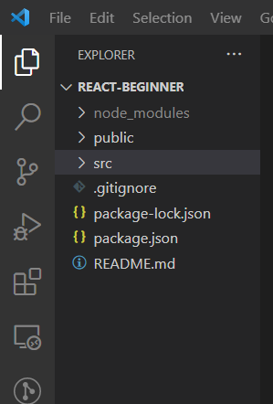
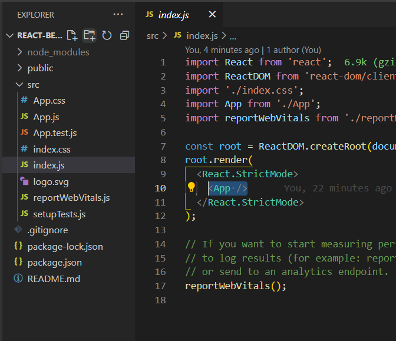
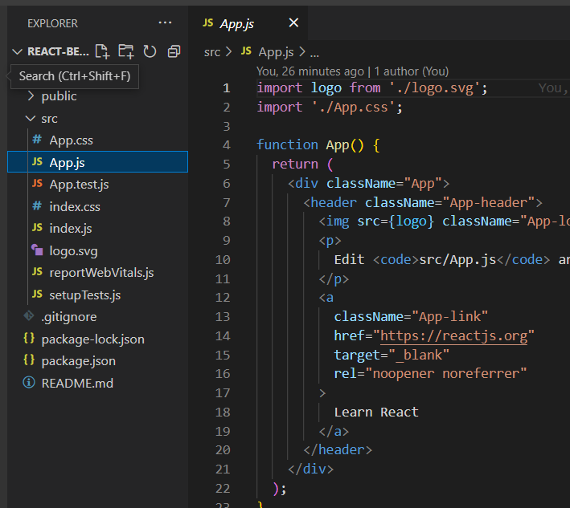
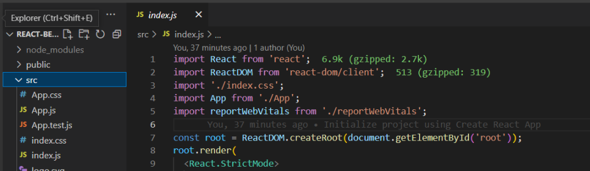
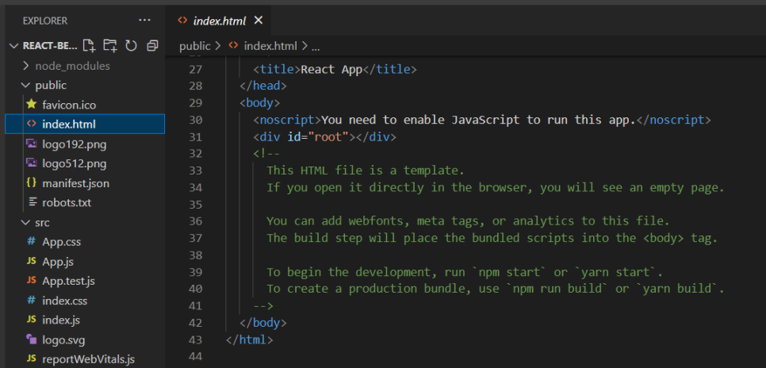
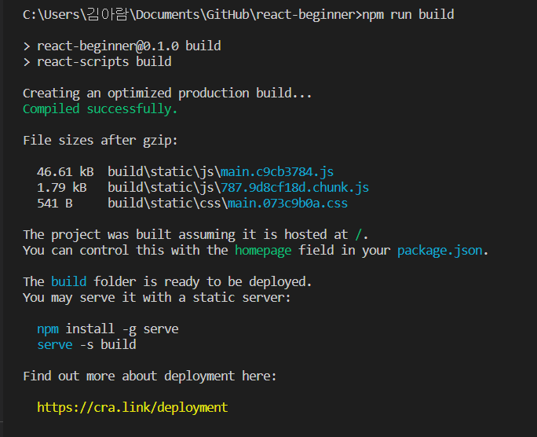
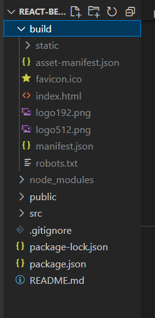
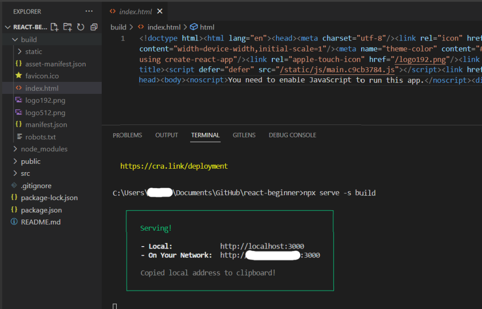

# Visual Studio Code 이용하여 수정 배포하기

---

---

 

## 1. 소스 코드 수정 방법
<https://opentutorials.org/course/4900/31264>

 

*React 개발 환경 구축 완성*

 

*src/index.js 의 \<App /\> tag*

src/index.js의 <App /> tag는 line 4에보이는 것처럼 ./App.js를 나타낸다.

 

*src/App.js*

즉, src/index.js의 <App /> 태그는 src/App.js의 App 함수를 나타낸다.

src/index.js의 <App /> 태그에 src/App.js가 포함되고

src/App.js에 있는 App함수 안에서 내용을 편집해 가며 UI를 만들어간다.

다시 말해, App.js의 App함수 안에 있는 코드가 화면을 구성한다고 보면 된다.

 

*src/App.js*

line 7에 보이는 root란 태그는 public/index.html에서 찾을 수 있다.

 

*public/index.html*

public/index.html에서 line 31에 root란 id 값을 가지고 있는 태그를 발견할 수 있다.

 

## 2. 소스 코드 배포하기
<https://opentutorials.org/course/4900/31264>

 

\<npm run build\> : build 명령실행 (배포판을 만드는 과정)

 

'npm run build' 명령을 실행을 하면 프로젝트 폴더에 build라는 폴더가 생성된다.

 

build/index.html는 파일의 용량을 줄이기 위하여 공백을 없애준 것. 이 결과물을 실행시키기 위해 'npx serve -s build'를 해주면 끝!!

 

### 배포 완료!!!

 
