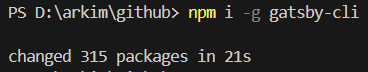
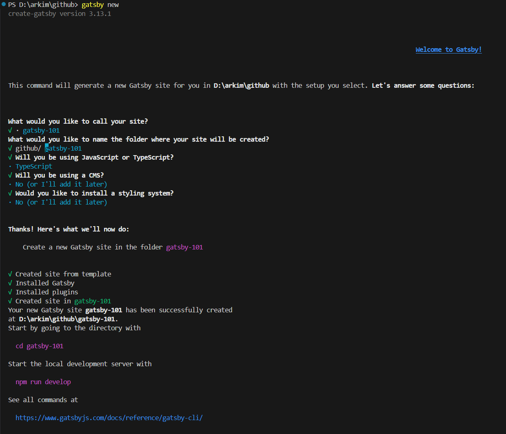
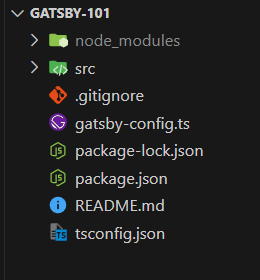
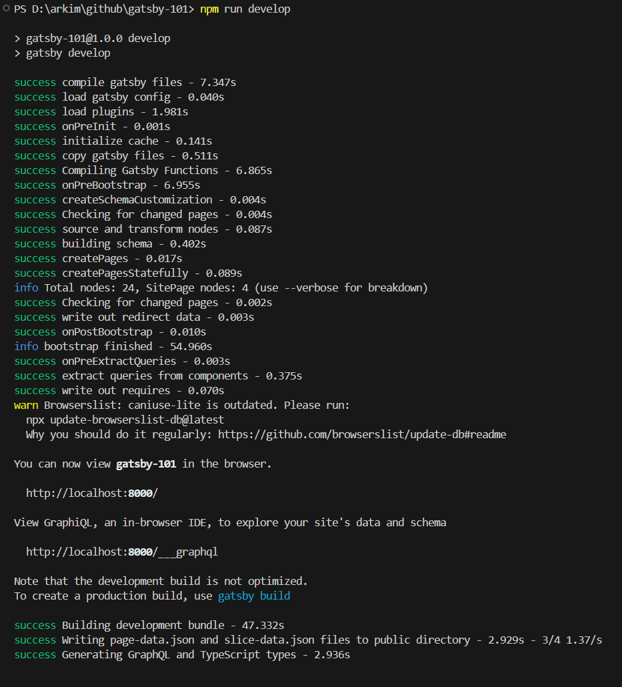
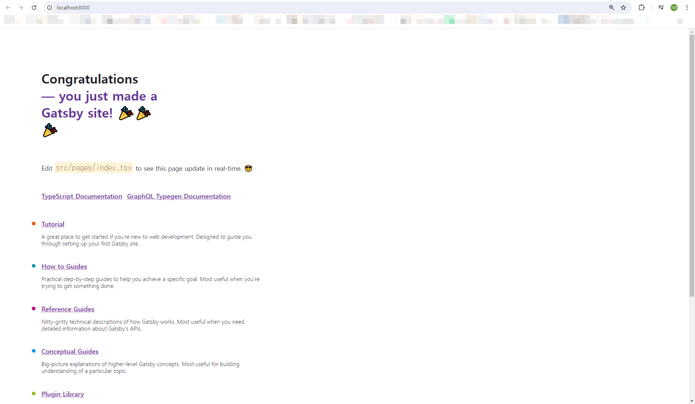

# [Gatsby 101] #0 Gatsby 프로젝트 시작하기

<br>

## Gatsby cli 글로벌 버전으로 설치하기

```sh
$ npm i -g gatsby-cli
```



<br>

## $ gatsby new

```sh
$ gatsby new
```





<br>

## npm run develop

```sh
$ npm run develop
```





<br>
