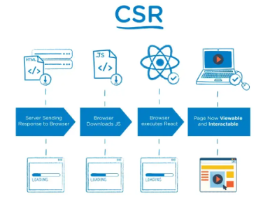
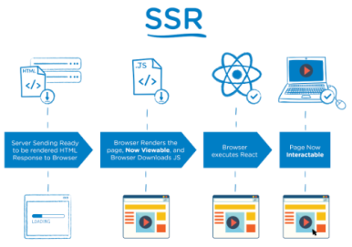
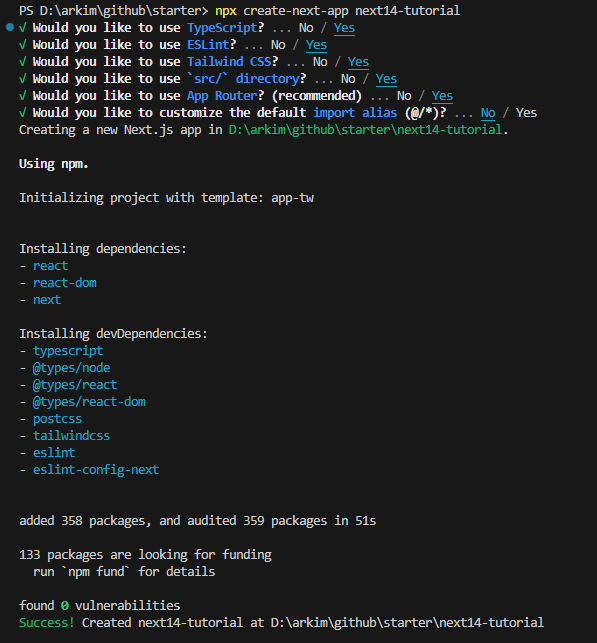
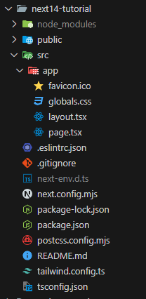
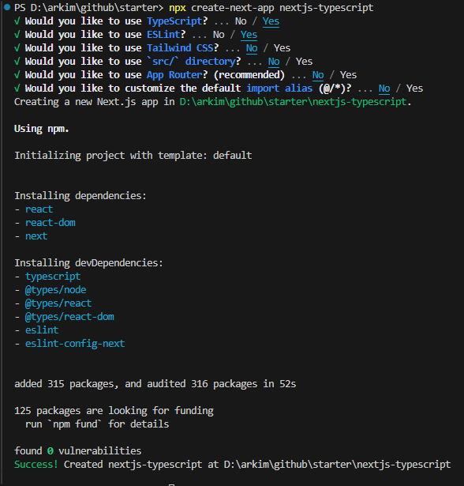
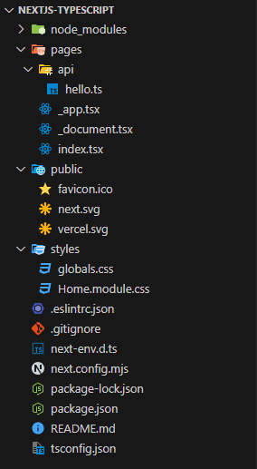

# Next.js 시작하기 - 환경설정 및 디렉토리 구조

- <https://nextjs.org/>

<br>

## 1. Next.js란?

React의 SSR(Server Side Rendering)을 쉽게 구현할 수 있게 도와 주는 간단한 프레임워크이다.

- 리액트로 개발할 때 SPA(Single Page Application)을 이용하며 CSR(Client Side Rendering)을 한다. CSR을 하면 첫페이지에서 빈 html을 가져와서 js파일을 해석하여 화면을 구성하기 때문에 포털 검색에 거의 노출 될 일이 없다.
- 하지만 Next.js에서는 Pre-Rendering을 통해서 페이지를 미리 렌더링 하며 완성된 HTML을 가져오기 때문에 사용자와 검색 엔진 크롤러에게 바로 렌더링 된 페이지를 전달한다. 검색엔진 최적화(SEO)가 장점이다.

<br>

|CSR|SSR|
|:--:|:--:|
||| 

<br>

## 환경 세팅

### npx create-next-app <프로젝트 이름>

```sh
$ npx create-next-app <프로젝트 이름>
or
$ npx create-next-app@latest <프로젝트 이름>
```

### 'src/' directory 사용 O





### 'src/' directory 사용 X





<br>
