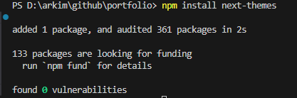

# Next.js+Tailwindcss 다크모드 구현하기 (w/ next-themes)

- <https://nextjs.org/>

<br>

## 1. next-themes 설치하기

```sh
$ npm install next-themes
```



<br>

## 2. Theme Provider 생성

**@/provider/ThemeProvider.tsx**

next-themes 라이브러리 설치 후 ThemeProvider Component를 만든다.

app/layout.tsx에 바로 적용해도 되지만 "use client"를 통해 client component로 따로 분리했다.

```js
"use client";

import { ThemeProvider as NextThemesProvider } from "next-themes";
import { type ThemeProviderProps } from "next-themes/dist/types";

export function ThemeProvider({ children, ...props }: ThemeProviderProps) {
  return (
    <NextThemesProvider attribute="class" defaultTheme="system" {...props}>
      {children}
    </NextThemesProvider>
  );
}
```

<br>

## 3. ThemeProvider 적용

**app/layout.tsx**

ThemeProvider.tsx를 생성 후 app/layout.tsx에 적용한다.

```ts
import { ThemeProvider } from "@/provider/ThemeProvider";
import Header from "@/components/Header";
import Footer from "@/components/Footer";

export default function RootLayout({
  children,
}: Readonly<{
  children: React.ReactNode;
}>) {
  return (
    <html lang="en" suppressHydrationWarning>
      <head></head>
      <body
        className={`relative w-full max-w-full h-full min-h-[100vh] text-black bg-white dark:text-white dark:bg-[#111010] ${inter.className}`}
      >
        <ThemeProvider>
          <div className="wrap relative max-w-2xl mx-auto px-7 py-9 md:py-14">
            <Header />
            <main id="main" className="relative">
              {children}
            </main>
            <Footer />
          </div>
        </ThemeProvider>
      </body>
    </html>
  );
}
```

<br>

## 4. tailwind.config.ts 수정

tailwind.config.ts에 darkMode: ["class"] 이 부분을 추가한다.

이 class는 ThemeProvider.tsx에서 ThemeProvider tag의 attribute와 연결된다.

dark/light에서 사용할 색상도 정의해야 한다.

```ts
import type { Config } from "tailwindcss";

const config: Config = {
  content: [
    "./src/pages/**/*.{js,ts,jsx,tsx,mdx}",
    "./src/components/**/*.{js,ts,jsx,tsx,mdx}",
    "./src/app/**/*.{js,ts,jsx,tsx,mdx}",
  ],

  theme: {
    extend: {
      colors: {
        dark: "#121619",
        light: "#ffffff",
      },
    },
  },
  darkMode: ["class"],
  plugins: [],
};
export default config;
```

<br>

## 5. ThemeBtn 버튼 생성

**@/components/ThemeBtn.tsx**

```js
import React, { useState, useEffect } from "react";
import { useTheme } from "next-themes";
import { AiOutlineMoon, AiOutlineSun } from "react-icons/ai";

export default function ThemeBtn() {
  const [mounted, setMounted] = useState(false);
  const { theme, setTheme } = useTheme();

  // useEffect only runs on the client, so now we can safely show the UI
  useEffect(() => {
    setMounted(true);
  }, []);

  if (!mounted) return null;

  if (theme === "dark") {
    return <AiOutlineMoon size={22} onClick={() => setTheme("light")} />;
  } else if (theme === "light") {
    return <AiOutlineSun size={22} onClick={() => setTheme("dark")} />;
  }
}
```

<br>

## 결과!!!


<br>
