# vite 설치 및 gh-pages로 배포하기

* <https://react.dev/>
* <https://vitejs.dev/>

<br>

## 목차

* [1. Vite 설치하기](#1-vite-설치하기)
* [2. gh-pages 배포하기](#2-gh-pages-배포하기)

<br>

<!-- 1. Vite 설치하기 -->
## 1. Vite 설치하기

### 1) npm create vite@latest

```sh
$ npm create vite@latest
```

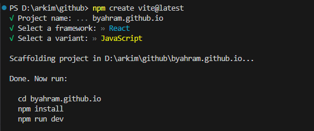

### 2) npm install

```sh
$ cd <프로젝트명>
$ npm install
```

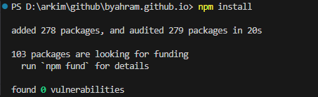

### 3) npm run dev

```sh
$ npm run dev
```

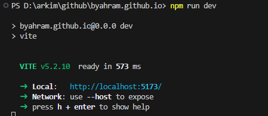

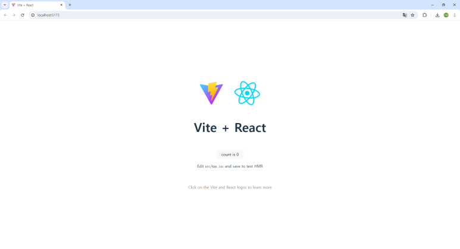

<br>

<!-- 2. gh-pages 배포하기 -->
## 2. gh-pages 배포하기

### 1) 작업 프로젝트와 github 레포지토리 연동

```sh
$ git remote add origin http://레포지토리주소.git
```

### 2) vite.config.js 수정 : base url 설정

```javascript
import { defineConfig } from "vite";
import react from "@vitejs/plugin-react";

// https://vitejs.dev/config/
export default defineConfig({
  // ex base: '/<레포지토리 이름>/',
  base: "/",
  plugins: [react()],
});
```

### 3) package.json 수정 : scripts 추가

CRA 에서는 빌드 폴더가 /build 이지만 Vite에서는 /dist 이므로

```sh
"scripts": {
    "dev": "vite",
    "build": "vite build",
    "lint": "eslint . --ext js,jsx --report-unused-disable-directives --max-warnings 0",
    "preview": "vite preview",
    "predeploy": "npm run build",        // 추가
    "deploy": "gh-pages -d dist"         // 추가 
},
```

### 4) npm run build

```sh
$ npm run build
```

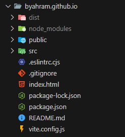 *dist 폴더 생성*

### 5) gh-pages 브랜치에 dist 폴더 추가

```sh
$ git add dist -f
$ git commit -m "any message"
$ git subtree push --prefix dist origin gh-pages
// gh-pages라는 branch가 새로 생기고 이 브랜치가 deploy전용 브랜치가 된다
```

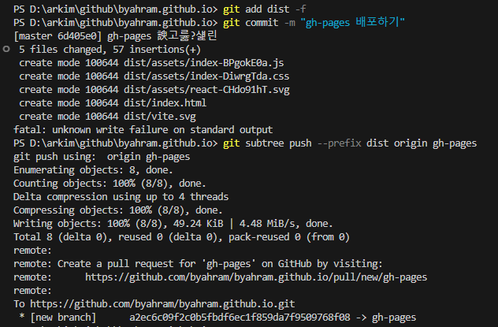

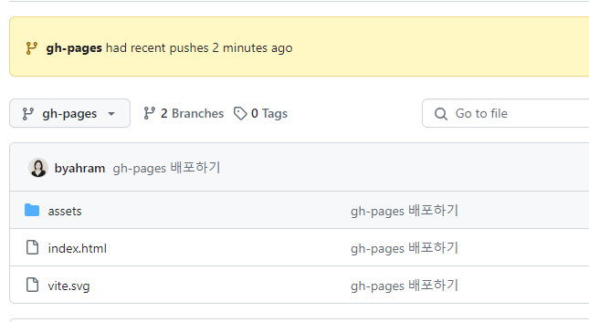 *깃헙 gh-pages 브랜치에 dist 폴더 올라간 것 확인*

### 6) 깃헙 repository 페이지 설정

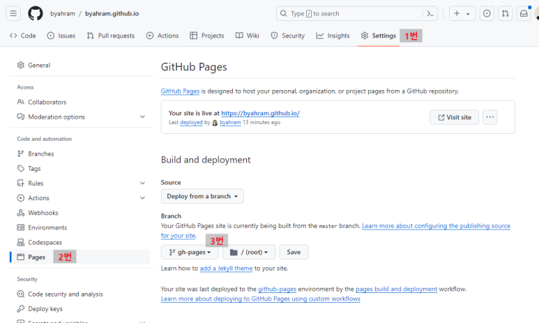

### 7) npm run deploy

```sh
$ npm run deploy
```

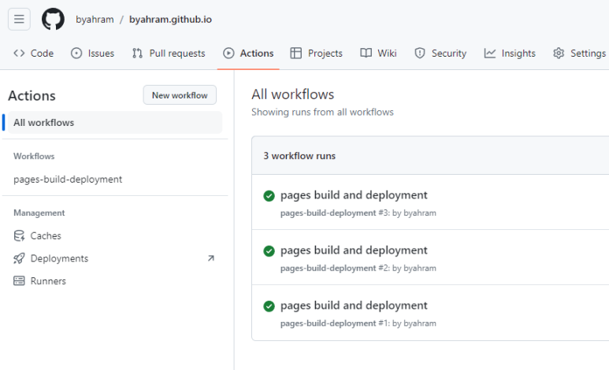

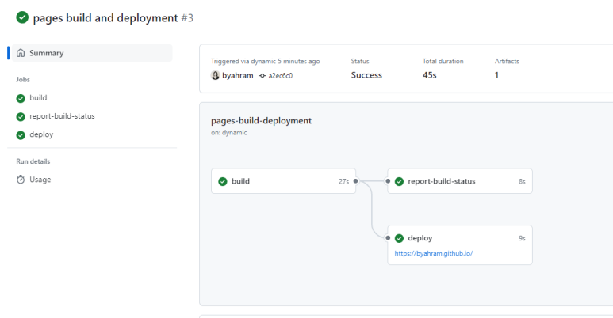

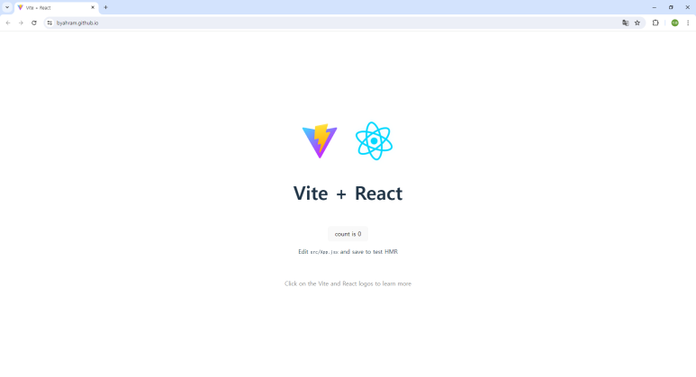 *https://byahram.github.io/ 에 배포된 것 확인*

### 8) 재배포 (업데이트)는 npm run deploy만 실행하면 된다!!

<br>
