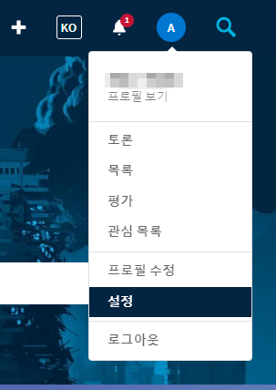
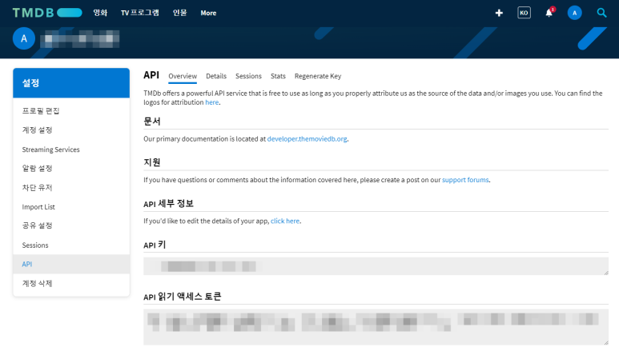

# TMDB API 연동하기 (w/axios)

<br>

## TMDB API KEY 생성하기

- <https://www.themoviedb.org/>

### 회원가입 > 로그인 > 프로필 > 설정 > API (왼쪽 메뉴) > API 키





<br>

## Axios 설치하기

- Axios는 브라우저, Node.js를 위한 Promise API를 활용하는 HTTP 비동기 통신 라이브러리다.
- 즉 백엔드랑 프론트엔드랑 통신을 쉽게하기 위해 Ajax와 더불어 사용한다.
- 중복된 부분을 계속 입력하지 않게 하기 위해 인스턴스화 한다.

```sh
$ npm install axios --save
```

<br>

## TMDB API 연동 및 인스턴스화 하기

### api/axios.js

```js
import axios from "axios";

const instance = axios.create({
  baseURL: "https://api.themoviedb.org/3",
  params: {
    api_key: "~https://www.themoviedb.org 에서 Get~",
    language: "ko-KR",
  },
});

export default instance;
```

### api/requests.js

```js
const requests = {
  fetchNowPlaying: "/movie/now_playing",
  fetchNetflixOriginals: "/discover/tv?with_networks=213",
  fetchTrending: "/trending/all/week",
  fetchTopRated: "/movie/top_rated",
  fetchActionMovies: "/discover/movie?with_genres=28",
  fetchComedyMovies: "/discover/movie?with_genres=35",
  fetchHorrorMovies: "/discover/movie?with_genres=27",
  fetchRomanceMovies: "/discover/movie?with_genres=10749",
  fetchDocumentaries: "/discover/movie?with_genres=99",
};

export default requests;
```

### ex1) 배너 이미지 정보 가져오기

```js
import React, { useEffect, useState } from "react";
import axios from "../api/axios";
import requests from "../api/requests";

const [movie, setMovie] = useState([]);

useEffect(() => {
  fetchData();
}, []);

const fetchData = async () => {
  // 현재 상영중인 영화 정보를 가져오기(여러 영화)
  const request = await axios.get(requests.fetchNowPlaying);

  // 여러 영화 중 영화 하나의 ID를 가져오기
  const movieId =
    request.data.results[
      Math.floor(Math.random() * request.data.results.length)
    ].id;

  // 특정 영화의 더 상세한 정보를 가져오기(비디오 정보도 포함)
  const { data: movieDetail } = await axios.get(`movie/${movieId}`, {
    params: { append_to_response: "videos" },
  });
  setMovie(movieDetail);
};
```

### ex2) 영화 나열하기

#### main.js

```js
import React from "react";
import Row from "../../components/Row";
import requests from "../../api/requests";

export default function MainPage() {
  return (
    <div>
      <Row title="NETFLIX ORIGINALS" id="NO" fetchUrl={requests.fetchNetflixOriginals} isLargeRow />
      <Row title="Trending Now" id="TN" fetchUrl={requests.fetchTrending} />
      <Row title="Top Rated" id="TR" fetchUrl={requests.fetchTopRated} />
      <Row title="Action Movies" id="AM" fetchUrl={requests.fetchActionMovies} />
      <Row title="Comedy Movies" id="Cm" fetchUrl={requests.fetchComedyMovies} />
    </div>
  );
}

```

#### Row.js

```js
import React, { useEffect, useState } from "react";
import axios from "../api/axios";

export default function Row({ isLargeRow, title, id, fetchUrl }) {
  const [movies, setMovies] = useState([]);

  useEffect(() => {
    fetchMovieData();
  }, []);

  const fetchMovieData = async () => {
    const request = await axios.get(fetchUrl);
    setMovies(request.data.results);
  };

  return (
    <div id={id} className="row__posters">
      {movies.map((movie) => (
        <div>
           handleClick(movie)}
          />
        </div>
      ))}
    </div>
  );
}
```

<br>
