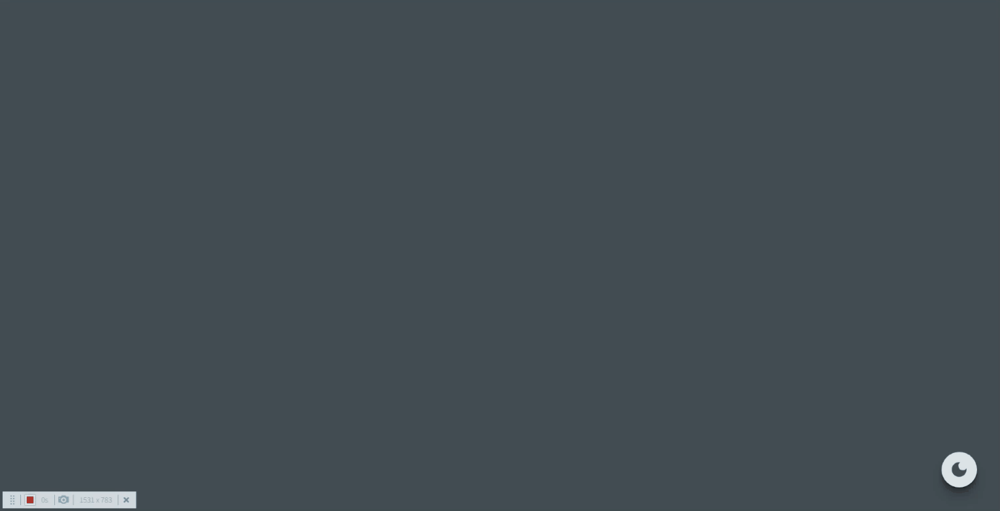

# [가상화폐 트랙커] 1. Recoil 사용하여 DarkMode 구현하기

<br>

## 0. recoil 설치하기

```sh
$ npm install recoil
```

<br>

## 1. main.tsx

```js
import React from "react";
import ReactDOM from "react-dom/client";
import App from "./App.tsx";
import { RecoilRoot } from "recoil";

ReactDOM.createRoot(document.getElementById("root")!).render(
  <React.StrictMode>
    <RecoilRoot>
      <App />
    </RecoilRoot>
  </React.StrictMode>
);
```

<br>

## 2. atoms.ts

```js
import { atom } from "recoil";

export const isDarkAtom = atom({
  key: "isDark",
  default: true,
});
```

<br>

## 3. styles.d.ts

```js
export interface DefaultTheme {
  bgColor: string;
  secondColor: string;
}
```

<br>

## 4. theme.ts

```js
import { DefaultTheme } from "styled-components";

export const darkTheme: DefaultTheme = {
  bgColor: "#444C54",
  secondColor: "rgb(222, 226, 230)",
};

export const lightTheme: DefaultTheme = {
  bgColor: "whitesmoke",
  secondColor: "#444C54",
};
```

<br>

## 5. App.tsx

```js
import { ThemeProvider } from "styled-components";
import { useRecoilValue } from "recoil";
import { darkTheme, lightTheme } from "./theme/theme";
import { isDarkAtom } from "./atoms";
import ThemeBtn from "./components/ThemeBtn";

function App() {
  const isDark = useRecoilValue(isDarkAtom);

  return (
    <ThemeProvider theme={isDark ? darkTheme : lightTheme}>
      <ThemeBtn />
    </ThemeProvider>
  );
}

export default App;
```

<br>

## 6. ThemeBtn.tsx

```js
import { MdDarkMode } from "react-icons/md";
import { useSetRecoilState } from "recoil";
import { isDarkAtom } from "../atoms";

export default function ThemeBtn() {
  const setDarkAtom = useSetRecoilState(isDarkAtom);
  const toggleDarkAtom = () => setDarkAtom((prev) => !prev);

  return <MdDarkMode onClick={toggleDarkAtom} size={30} className="icon" />;
}
```

<br>

## 결과!!!



<br>
