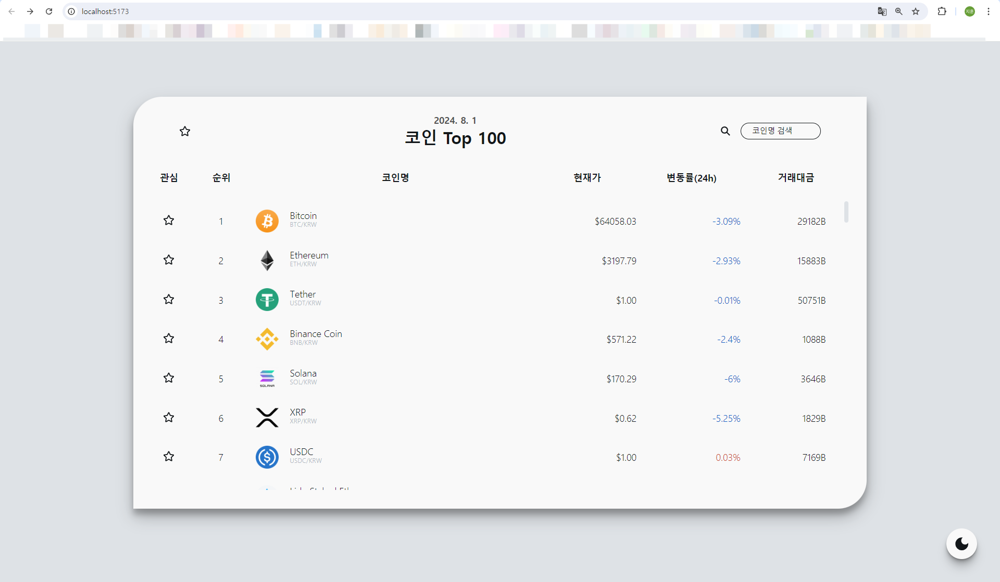
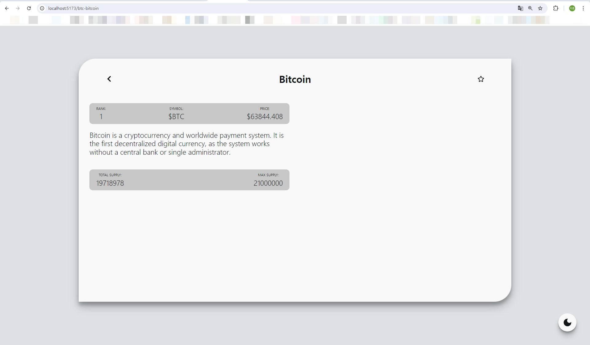

# [가상화폐 트랙커] 2. react-query + coinpaprika api 코인 정보 가져오기

<br>

## 1. main.tsx

```js
import React from "react";
import ReactDOM from "react-dom/client";
import App from "./App.tsx";
import { QueryClient, QueryClientProvider } from "react-query";
import { RecoilRoot } from "recoil";

const queryClient = new QueryClient();

ReactDOM.createRoot(document.getElementById("root")!).render(
  <React.StrictMode>
    <RecoilRoot>
      <QueryClientProvider client={queryClient}>
        <App />
      </QueryClientProvider>
    </RecoilRoot>
  </React.StrictMode>
);
```

<br>

## 2. api/api.ts

```js
const BASE_URL = `https://api.coinpaprika.com/v1`;

export function fetchCoins() {
  return fetch(`${BASE_URL}/coins`).then((response) => response.json());
}

export function fetchCoinDetail(coinId: string) {
  return fetch(`${BASE_URL}/coins/${coinId}`).then((response) =>
    response.json()
  );
}

export function fetchPrices() {
  return fetch(`${BASE_URL}/tickers?quotes=USD&limit=100`).then((response) =>
    response.json()
  );
}

export function fetchPriceDetail(coinId: string) {
  return fetch(`${BASE_URL}/tickers/${coinId}`).then((response) =>
    response.json()
  );
}

export async function fetchCoinHistory(coinId: string) {
  return await fetch(
    `https://ohlcv-api.nomadcoders.workers.dev?coinId=${coinId}`
  ).then((response) => response.json());
}
```

<br>

## 3. api/interface.ts

```js
export interface CoinsInterface {
  id: string;
  name: string;
  symbol: string;
  rank: number;
  is_new: boolean;
  is_active: boolean;
  type: string;
}

export interface CoinDetailInterface {
  id: string;
  name: string;
  symbol: string;
  rank: number;
  is_new: boolean;
  is_active: boolean;
  type: string;
  logo: string;
  description: string;
  message: string;
  open_source: boolean;
  hardware_wallet: boolean;
  started_at: string;
  development_status: string;
  proof_type: string;
  org_structure: string;
  hash_algorithm: string;
  first_data_at: string;
  last_data_at: string;
}

export interface PriceInterface {
  id: string;
  name: string;
  symbol: string;
  rank: number;
  circulating_supply: number;
  total_supply: number;
  max_supply: number;
  beta_value: number;
  first_data_at: string;
  last_updated: string;
  quotes: {
    USD: {
      price: number,
      volume_24h: number,
      volume_24h_change_24h: number,
      market_cap: number,
      market_cap_change_24h: number,
      percent_change_1h: number,
      percent_change_1y: number,
      percent_change_6h: number,
      percent_change_7d: number,
      percent_change_12h: number,
      percent_change_15m: number,
      percent_change_24h: number,
      percent_change_30d: number,
      percent_change_30m: number,
      ath_price: number,
      ath_date: string,
      percent_from_price_ath: number,
    },
  };
}

export interface ChartHistoricalInterface {
  time_open: string;
  time_close: string;
  open: number;
  high: number;
  low: number;
  close: number;
  volume: number;
  market_cap: number;
}

export interface CoinHistoryInterface {}
```

<br>

## 4. pages/Main.tsx

전체 코인 가격 리스트 가져오기

```js
import { useQuery } from "react-query";
import styled from "styled-components";
import { fetchTickers } from "../api/api";
import { TickerInterface } from "../api/interface";
import CoinRow from "../components/CoinRow";

export default function Main() {
  const { isLoading, data } = useQuery<PriceInterface[]>(
    "allPrices",
    fetchPrices
  );

  return (
    <MainContainer>
      {isLoading ? (
        <div>Loading</div>
      ) : (
        <>
          {data?.map((coin) => (
            <CoinRow coin={coin} />
          ))}
        </>
      )}
    </MainContainer>
  );
}
```

<br>

## pages/Detail.tsx

코인 디테일(정보/가격) 가져오기

```js
import React, { useState } from "react";
import { useLocation, useNavigate, useParams } from "react-router-dom";
import styled from "styled-components";
import {
  ChartHistoricalInterface,
  CoinDetailInterface,
  PriceInterface,
} from "../api/interface";
import { useQuery } from "react-query";
import {
  fetchCoinDetail,
  fetchCoinHistory,
  fetchPriceDetail,
} from "../api/api";
import { FaRegStar, FaStar, FaChevronLeft } from "react-icons/fa";

interface RouteParams {
  coinId: string;
}

interface RouteState {
  name: string;
}

export default function Detail() {
  const { coinId } = useParams<RouteParams>();
  const { state } = useLocation<RouteState>();

  const [tab, setTab] = useState("chart");

  // react-query : info
  const { isLoading: infoLoading, data: infoData } =
    useQuery<CoinDetailInterface>(["info", coinId], () =>
      fetchCoinDetail(coinId!)
    );

  // react-query : price
  const { isLoading: priceLoading, data: priceData } = useQuery<PriceInterface>(
    ["price", coinId],
    () => fetchPriceDetail(coinId!)
  );

  const loading = infoLoading || priceLoading || chartLoading;

  return (
    <DetailWrap>
      <Container>
        {loading ? (
          <Loader>Loading...</Loader>
        ) : (
          <ContWrap>
            <OverviewWrap>
              <Overview>
                <OverviewItem>
                  <span>Rank:</span>
                  <span>{infoData?.rank}</span>
                </OverviewItem>
                <OverviewItem>
                  <span>Symbol:</span>
                  <span>${infoData?.symbol}</span>
                </OverviewItem>
                <OverviewItem>
                  <span>Price:</span>
                  <span>${priceData?.quotes?.USD?.price?.toFixed(3)}</span>
                </OverviewItem>
              </Overview>
              <Description>{infoData?.description}</Description>
              <Overview>
                <OverviewItem>
                  <span>Total Supply:</span>
                  <span>{priceData?.total_supply}</span>
                </OverviewItem>
                <OverviewItem>
                  <span>Max Supply:</span>
                  <span>{priceData?.max_supply}</span>
                </OverviewItem>
              </Overview>
            </OverviewWrap>
          </ContWrap>
        )}
      </Container>
    </DetailWrap>
  );
}
```

<br>

## 결과!!!





<br>
