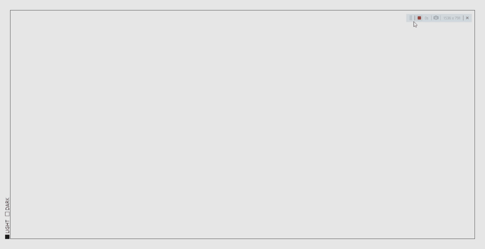

# [주간 플래너 프로젝트] 1. Recoil 사용하여 Dark/Light 테마 구현하기

<br>

## 0. recoil 설치하기

```sh
$ npm install recoil
```

<br>

## 1. main.tsx

```js
import React from "react";
import ReactDOM from "react-dom/client";
import App from "./App.tsx";
import { RecoilRoot } from "recoil";

ReactDOM.createRoot(document.getElementById("root")!).render(
  <React.StrictMode>
    <RecoilRoot>
      <App />
    </RecoilRoot>
  </React.StrictMode>
);
```

<br>

## 2. atoms.ts

```js
import { atom } from "recoil";

export enum ThemeFlag {
  light,
  dark,
}

export const themeAtom = atom({
  key: "themeAtom",
  default: ThemeFlag.light,
});

```

<br>

## 3. styles.d.ts

```js
export interface DefaultTheme {
  textColor: string;
  bgColor: string;
  accentColor: string;
  cardBgColor: string;
}
```

<br>

## 4. theme.ts

```js
import { DefaultTheme } from "styled-components";

export const darkTheme: DefaultTheme = {
  bgColor: "#0D0D0D",
  textColor: "#F2F2F2",
  accentColor: "#9c88ff",
};

export const lightTheme: DefaultTheme = {
  bgColor: "#E6E6E6",
  textColor: "#1A1A1A",
  accentColor: "#9c88ff",
};
```

<br>

## 5. App.tsx

```js
import { ThemeProvider } from "styled-components";
import { useRecoilValue } from "recoil";
import GlobalStyle from "./styles/GlobalStyle";
import { darkTheme, lightTheme } from "./theme";
import { themeAtom } from "./atoms";
import Root from "./pages/Root";

function App() {
  const isDark = useRecoilValue(themeAtom);

  return (
    <ThemeProvider theme={isDark ? darkTheme : lightTheme}>
      <GlobalStyle />
      <Root />
    </ThemeProvider>
  );
}

export default App;
```

<br>

## 6. ThemeBtn.tsx

```js
import { useSetRecoilState, useRecoilValue } from "recoil";
import styled, { css } from "styled-components";
import { ThemeFlag, themeAtom } from "../atoms";
import { darkTheme } from "../theme";

export default function ThemeBtn() {
  const setThemeAtom = useSetRecoilState(themeAtom);
  const currTheme = useRecoilValue(themeAtom);

  const toggleDarkAtom = () => {
    setThemeAtom((prev) =>
      prev === ThemeFlag.light ? ThemeFlag.dark : ThemeFlag.light
    );
  };

  return (
    <ThemeWrap id="theme">
      <ThemeInner>
        {/* LightBtn */}
        <BtnWrap onClick={toggleDarkAtom}>
          <LightBtn currtheme={currTheme} />
          <Label>Light</Label>
        </BtnWrap>

        {/* DarkBtn */}
        <BtnWrap onClick={toggleDarkAtom}>
          <DarkBtn currtheme={currTheme} />
          <Label>Dark</Label>
        </BtnWrap>
      </ThemeInner>
    </ThemeWrap>
  );
}

const ThemeWrap = styled.div`
  position: fixed;
  left: -2.7rem;
  bottom: 5.5rem;
  transform: rotate(-90deg);
  z-index: 1000;
`;
const ThemeInner = styled.div`
  display: flex;
  gap: 0.75rem;
`;
const BtnWrap = styled.div`
  display: flex;
  justify-content: center;
  align-items: center;
  gap: 0.25rem;
  text-transform: uppercase;
  font-weight: 500;
`;
const Label = styled.label`
  cursor: pointer;
  font-size: medium;
  color: ${(props) => props.theme.textColor};
`;

// BtnProps
interface BtnProps {
  currtheme: ThemeFlag;
}
const Btn = css<BtnProps>`
  width: 0.75rem;
  aspect-ratio: 1;
  cursor: pointer;
  border: 1px solid
    ${(props) =>
    props.currtheme === ThemeFlag.light
      ? props.theme.textColor
      : darkTheme.textColor};
`;
const LightBtn = styled.button<BtnProps>`
  ${Btn}
  background: ${(props) =>
    props.currtheme === ThemeFlag.light
      ? props.theme.textColor
      : darkTheme.bgColor};
`;
const DarkBtn = styled.button<BtnProps>`
  ${Btn}
  background: ${(props) =>
    props.currtheme === ThemeFlag.light
      ? props.theme.bgColor
      : darkTheme.textColor};
`;
```

<br>

## 결과!!!



<br>
