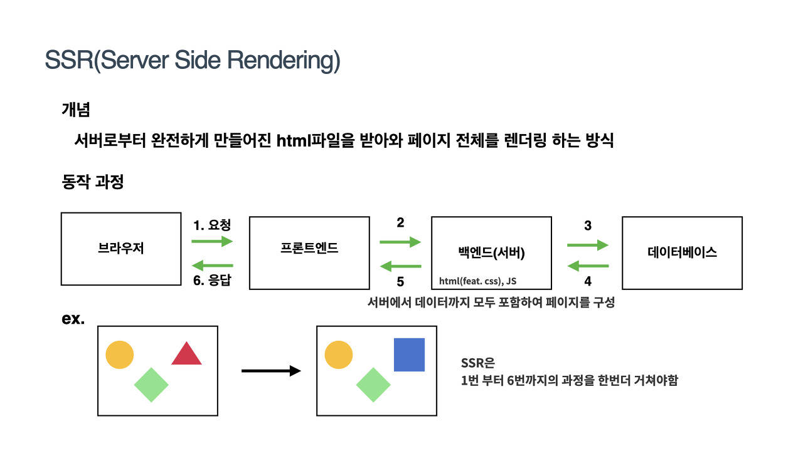
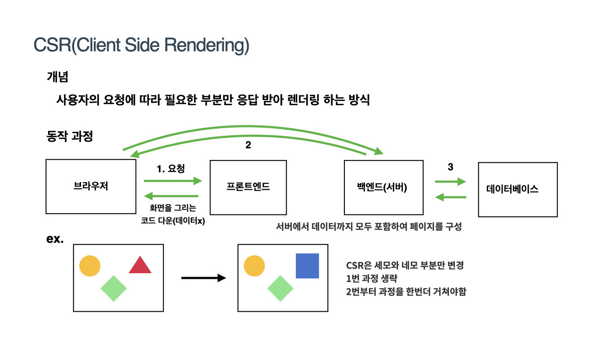
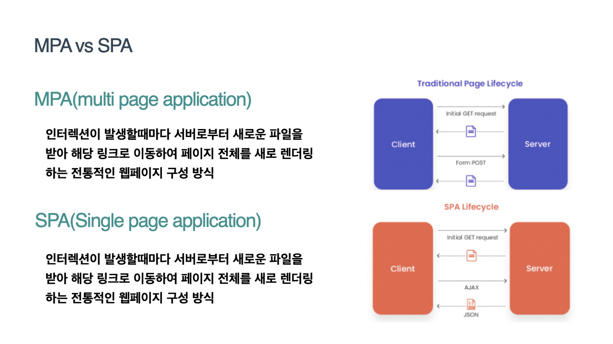
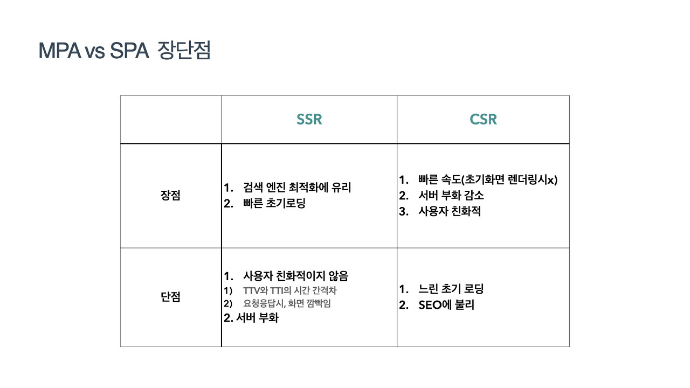
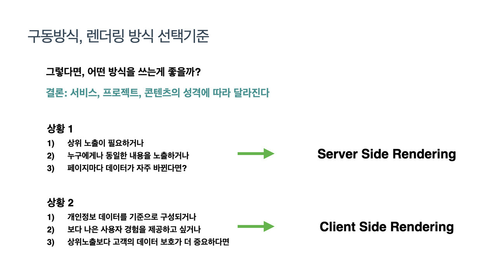
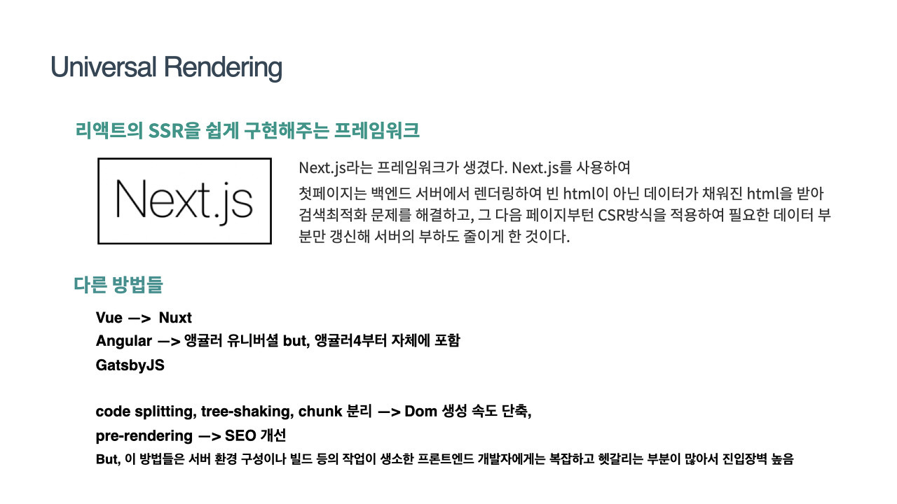
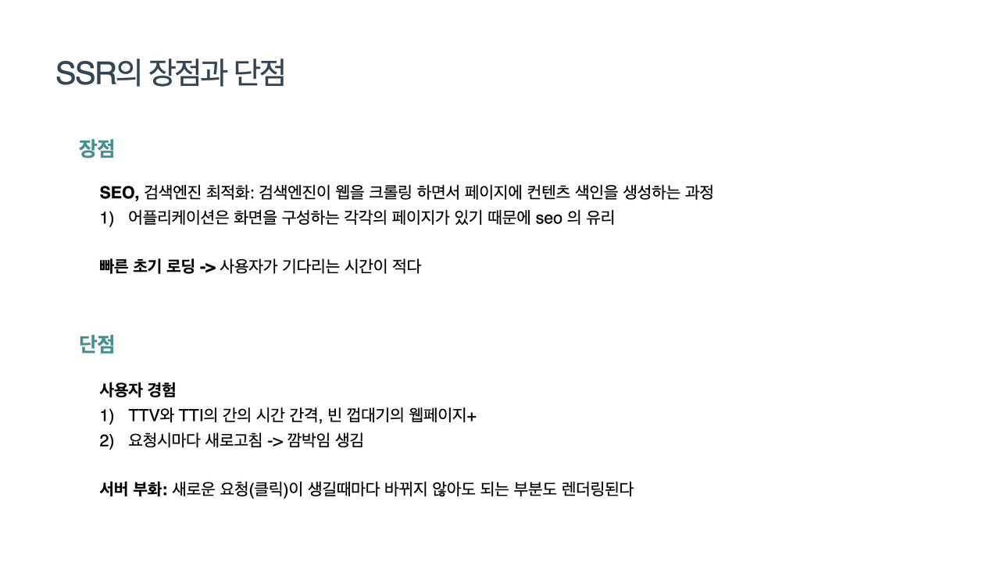
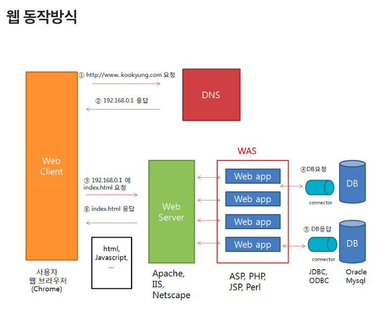

# 예상 면접 질문 - JAVASCRIPT

---

---

 

### 쿠키 vs 세션 vs 웹스토리지
<https://www.youtube.com/watch?v=tosLBcAX1vk>

* **쿠키** : 클라이언트(브라우저)에 저장되는 키와 같이 들어있는 작은 파일이다.
* **세션** : 사용자 정보를 파일 브라우저에 저장하는 쿠키와 달리 세션은 서버 측에서 관리한다.
* **웹스토리지** : 클라이언트에 데이터를 저장할 수 있도록 HTML5부터 추가된 저장소, 쿠키보다 큰 저장 용량 지원
* 스트림 형태로 전송되므로 입력 data의 개수나 크기에 제한이 없다. 복잡한 형태의 자료를 전달할 때 유용 입력한 데이터가 usl상에 보이지 않기 때문에 보안이 우수하다.

 

### get vs post
**get** : 입력 데이터를 URL정보에 붙여서 전송해서 보안이 취약하다. 전송 속도가 POST방식보다 빠르고 전송해야 할 데이터가 적을 때 이용한다.

**post** : 입력한 데이터를 본문 안 에 포함하여 전송한다. POST 방식은 데이터를 서버로 제출하여 추가 또는 수정하기 위해서 사용하는 방식. 캐싱 할 수 없다.

* GET은 입력한 url에 존재하는 자원에 요청을 하는 것
* GET은 서버에서 어떤 데이터를 가져와서 보여준다거나 하는 용도이다. 값이나 상태등을 바꿀 수 없다.
* 응답은 json 형태로 넘어온다.
* POST는 새로운 리소스를 생성할 때 사용한다.
* 사용자가 생성한 파일을 서버에다가 업로드할 때 사용한다.

 

### API란?
남의 데이터 가져오는 것.

한 프로그램에서 다른 프로그램으로 데이터 주고받기 위한 방법.

Application Programming Interface. 어플리케이션을 프로그래밍 하는데 쓰이는 인터페이스. 키보드와 비슷. 응용프로그램들간에 데이터를 주고받는 방식. 프로그램과 또 다른 프로그램을 연결해주는 중간다리 역할. 소프트웨어가 다른 소프트웨어로부터 지정된 형식으로 요청, 명령을 받을 수 있는 수단. 양식이 필요, 인증이 필요할 수 있고, 제한이 있을 수 있다. 이렇게 응용프로그램과 소통하는 방식이 API. ex) 이 버튼을 누르면 로그인, 로그아웃. 저걸 누르면 사진 업로드, 팔로잉. 그래서 앱이 이 키들을 누르면 백엔드 데이터베이스, 서버에 알려주는 것.

 

### API 장단점
**장점**으로는 신규 서비스를 생성할 필요가 없습니다. 기본 기능은 기존 서비스를 따르는 것이므로 개발 비용이 억제됩니다. 회사의 보안 시스템을 이용할 수 있습니다. 정보는 실시간으로 반영하여 자동 연계 시스템으로 데이터를 바로 사용할 수 있습니다.

**단점**으로는 API 사양이 변경될 때마다 조정이 필요합니다.사양 변경에 대응하지 않을 경우 시스템 오류가 발생할 수 있으므로 주의하시기 바랍니다.

 

### CSR / SSR
* <https://miracleground.tistory.com/165>
* csr : client side rendering. 렌더링이 클라이언트 쪽에 일어남. 서버가 보내준 HTML, JS를 렌더링.
* ssr : server side rendering. 서버에서 렌더링 준비를 끝마친 상태로 클라이언트에 전달하는 방식.

 

### 리팩토링
리팩토링은 프로그램이 동작 되는 상태에서 내부 코드들을 정리하는 것.

 

### axios
뷰에서 권고하는 HTTP 통신 라이브러리. Promise 기반.

 

### 홈페이지 속도를 개선하려면?
* 외부파일로 CSS파일, 자바스크립트를 활용하라.
* 과도한 이미지, 플래쉬, 사운드 파일은 자제하라.
* 이미지 용량을 줄여라.
* 자바스크립트를 압축하라.

 

### 유닛 테스트
유닛 테스트는 컴퓨터 프로그래밍에서 소스 코드의 특정 모듈이 의도된 대로 정확히 작동하는지 검증하는 절차 다.

 

### OOP / 객체 지향 프로그래밍이란?
프로그램을 수많은 '객체(object)'라는 기본 단위로 나누고 이들의 상호작용으로 서술하는 방식이다. 객체란 하나의 역할을 수행하는 '메소드와 변수(데이터)'의 묶음으로 봐야 한다.
* 객체 : 데이터는 변수 → 배열 → 객체 순으로 발전. 변수는 값을 하나밖에 못 만드니 배열이 생기고, 배열은 값밖에 담지 못하므로, 값 뿐만 아닌 이를 구분 짓는 키를 만들어 객체에 저장. 이러면 세상의 모든 것들을 잠을 수 있다.

그래서 프로그래밍들이 객체 지향이 된 것. 모든 것들을 담을 수 있다.

객체가 진화해 json → api 가 된 것. json, api도 보면 그래서 다 객체 형태.

어떤 개념에 대한 자료형과 함수를 '객체' 형태로 함께 묶어서 관리하기 위해  객체 지향 프로그래밍 패러다임이 등장하게 되었다. 핵심 포인트는 객체 내부에 자료형 필드와 함수가 함께 존재 하는 것이다. 가능한 모든 물리적, 논리적 요소를 객체로 만드는 것이 객체 지향 프로그래밍이다.

 

### URI / URL
* URI : 특정 리소스를 식별하는 ‘통합 자원 식별자’.
* URL : 웹 주소. 리소스가 네트워크 상 어디 있는지 알려주기 위한 규약.

 

### 플로그인
인터넷이 발달하고 웹 브라우저가 담당해야 할 부분이 증가하면서 메인 프로그램인 웹 브라우저가 처리하지 못하는 부분을 처리해 주는 작은 프로그램들을 플러그인이라고 부르기 시작하였다.

 

### Webpack / Babel / Polyfill
* Webpack : 모듈 번들링. 브라우저에서 자스 파일들을 묶어(번들링) 사용하기 위함
  * <https://velog.io/@yon3115/프론트엔드-필수-Webpack이란>
* Babel : 자스 컴파일러. 최신 자스 ⇒ ES5, ES6. 최신 자스를 사용하여 개발 및 배포했을 때, 사용자의 브라우저가 모두 최신이 아니므로 ES5나 ES6로 바꿔주는 컴파일러. ****모든 브라우저에서 볼 수 있도록 크로스 브라우징 해결해줌. ES6 코드를 ES5 코드로 변환해주는 일에서 리액트의 JSX문법, 타입스크립트, 코드 압축, Proposal 까지 처리해준다. 리액트, 뷰에는 바벨이 기본적으로 설치되어 있기 때문에 이를 신경 쓸 필요가 없음.
* Polyfill : 브라우저에서 지원하지 않는 코드를 사용 가능한 코드 조각이나 플러그인으로 변환한 코드. ES6의 map, promise, set, object.assigin() 이런 애들을 바벨이 해줄 수 없어 Polyfill로 메꿈.

 

### 번들러
<https://developer-alle.tistory.com/297>

여러 개의 파일을 하나로 묶어줌.

기술의 발전으로 코드가 길어짐에 따라 여러 문제가 발생하는데 이를 해결해줌.

여러 번들러 중 하나가 웹팩.
* 네트워크 병목 현상 해결 - 여러 파일을 최적화 해서 하나의 파일로 묶기 때문에 주고 받는 파일의 크기를 줄여줆
* 모듈 단위 코딩 - 유지 보수가 편함, 코드의 가독성 향상
* 다양한 서드파티 기능 이용
  * Webpack의 경우 Babel-loader과 같은 다양한 로더를 이용해서 모던 자바스크립트나 SASS를 사용할 수 있다.

 

### CORS 
교차 출처 리소스 공유. 보안 상의 이유로, 브라우저는 스크립트에서 시작한 교차 출처 HTTP 요청을 제한함.

 

### php 디버깅, 방법
코더는 프로그램을 작성할 때 때때로 구문을 놓치거나 다른 것이 잘못될 수 있습니다. 이 상황에서 프로그램을 수정하는 가장 쉬운 방법은 실행을 한 줄 씩 확인하는 것입니다. 이 프로세스를 코드 디버깅이라고 합니다.

방법
* 분석을 기반으로 문제 가져오기
* 코드에서 변경을 수행하고 실행을 재 시도 하십시오.

 

### MySQL
MySQL은 php를 가장 많이 사용하는 DB이다.

데이터베이스라는 분류의 제품군에 속한 구체적인 상품으로 ORACLE에 의해서 개발되고 있다. 오픈소스이고, 가장 많은 사용자를 가지고 있는 데이터베이스 시스템에 속한다. MySQL과 같은 분류에 속한 데이터베이스로는 ORACLE, MSSQL 등이 있다.

장점
* 오픈 소스 라이센스를 따르기 때문에 무료로 사용할 수 있습니다.
* 다양한 운영체제에서 사용할 수 있으며, 여러 가지의 프로그래밍 언어를 지원합니다.
* 크기가 큰 데이터 집합도 아주 빠르고 효과적으로 처리할 수 있습니다.
* 널리 알려진 표준 SQL 형식을 사용합니다.

 

### 브라우저 주소창에 www.google.com을  을 입력하면 어떤 일이 일어날까?
브라우저 주소창에 www.naver.com치면  -> 네이버 서버 -> DNS(실제 서버가 어디에 있는지 알고 있는 서버)가 연결해줄 곳을 찾음     -> (여기서 주소 앞에 https가 붙었다면 https방식으로 통신하겠다.)   -> 서버의 기본 설정이 대부분 index.html되어 있어 서버에서 이 파일을 클라이언트로 보냄    -> 브라우저는 텍스트로 이루어진 index.html 파일을 파싱  -> 한 줄 씩 읽으면서 DOM트리 생성.    -> 중간에 link태그를 만나 css요청이 발생하면, 요청과 응답 과정을 거치고 css를 파싱함    -> CSS파싱이 끝나면 중단된 html을 다시 읽고 DOM트리를 완성    -> 완성된 DOM트리와 CSSOM 트리를 합쳐 Render Tree를 만들고 그린다. 중간에 HTML 파서가 Script태그를 만나면 javascript 코드를 실행하기 위해 파싱을 중단  -> 제어 권한을 자바스크립트 엔진에게 넘기고, 자바스크립트 코드 또는 파일을 로드 해서 파싱하고 실행.
1. 웹클라이언트(내컴퓨터)가 HTTP를 사용하여 DNS에 도메인의 IP주소를 요청
2. DNS가 웹클라이언트에게 IP주소를 응답
3. 웹클라이언트가 웹서버(해당 IP가 운영되고 있는 서버컴퓨터)에게 해당 IP주소의 html문서를 요청
4. 웹어플리케이션서버(WAS)와 데이터베이스(DB)에서 웹페이지 작업 처리
5. 위의 작업처리 결과를 웹서버로 전송
6. 웹서버가 웹클라이언트에게 html 문서결과를 응답
7. 웹클라이언트가 html(css,js) 파일을 parsing하여 DOM tree를 만든 후 실행한다

 

### 브라우저의 UI 렌더링 과정
* Recalculate Style
  * : 요소에 적용할 스타일 계산.
* Layout
  * : 요소의 레이아웃 생성, 화면에 배치.
* Paint
  * : 생성된 모든 레이아웃에 픽셀 추가. GPU는 필요에 따라 생성한 레이어의 비트맵을 사용해 화면에 렌더링.
* Composite Layers
  * : 생성한 레이어 계층 합성.

 

### DNS
Domain Naming System. 도메인을 IP주소로 변환하거나 반대의 변환을 수행하는 시스템.

클라이언트 → 리졸버(요청) → 네임 서버 : 해당 도메인의 IP 찾음. → 리졸버(응답) → 클라이언트

 

### DNS 동작 방식
브라우저

→ 해결사 서버에 요청(’www.hanamon.kr’ 도메인의 IP 주소를 알고 싶을 때)

→ ‘최상위 기관에서 관리하는’ 네임 서버에 요청(.kr 도메인이 있나요?)

→ 해당 네임 서버 응답(.kr은 한국 국가 서버이니 .kr 네임 서버로 이동)

→ 해결사 서버가 .kr 네임 서버에 요청(hanamon.kr 있나요?)

→ .kr 네임 서버 응답(네 가비아로 가세요~). 이때 hanamon.kr 있나요로 물어봐도 응답 가능.

→ 해결사 서버가 가비아 네임 서버에 요청(www.hanamon.kr 있나요?)

→ 가비아 네임 서버 응답(네 12.345.678.900으로 가세요!)

→ 해결사 서버가 브라우저에게 알려줌.(12.345.678.900 이동)

 

### Protocol
인터넷에서 컴퓨터들 간에 데이터를 주고받기 위한 통신 규칙

 

### IP
네트워크에서 장치들이 서로 인식하고 통신하기 위해 사용하는 특수한 번호.

 

### TCP/IP
컴퓨터들 간에 데이터를 주고받는 방식을 정의한 규칙 체계

 

### Hypertext
링크를 통해 서로 연결되어 원하는 정보를 얻게 해주는 형태의 문서.

 

### HTTP
HyperText Transfer Protocol. 하이퍼 텍스트(문서)를 전송하기 위한 프로토콜(통신 규칙).

서버와 클라이언트(웹 브라우저) 간 통신을 주고받을 때 쓴 규칙.

 

### HTTP 패킷
클라이언트가 서버로 요청할 때 보내는 데이터.

HTTP 프로토콜을 쓰므로, 앞에 HTTP가 붙고 인터넷을 통해 보내는 데이터를 패킷 이라 표현하므로, HTTP패킷 이라 부른다.

구조 - 헤더 / 바디
* 요청 헤더 : 요청하는 페이지의 주소와 현재 컴퓨터의 정보가 전송되는 부분.
* 요청 바디 : POST 요청 시 전송되는 데이터가 들어가는 부분. GET 요청 시는 빈칸.
* 응답 헤더 : 응답 페이지의 상태와 서버에 관한 정보 전송되는 부분.
* 응답 바디 : 페이지의 HTML 소스가 전송되는 부분.

 

### Rest API
자원을 이름(URI)으로 구분하여 해당 자원의 상태를 주고받는 모든 것을 의미.
1. HTTP URI(Uniform Resource Identifier)를 통해 자원(Resource)을 명시하고,
2. HTTP Method(POST, GET, PUT, DELETE)를 통해
3. 해당 자원(URI)에 대한 CRUD Operation을 적용하는 것을 의미합니다.

웹의 통신 규약인 HTTP 이용. 특정 기술을 의미하는 게 아니라 HTTP를 이용해 통신할 때, HTTP가 가진 잠재력을 최대로 사용하도록 유도한 방식.
* REST는 웹에서 데이터를 전송하고 처리하는 방법을 정의한 인터페이스를 말한다. 모든 데이터 구조와 처리방식은 REST에서 URL을 통해 정의되며, 그래서 매우 직관적으로 이해하기 쉽다. 이는 대중에게 서비스를 제공할 때 좀 더 쉽게 다가갈 수 있도록 하는 요소이기도 하다. (하단 HTTP 메소드와 응답코드 참조!!)

 

### Restful API
자원을 이름(자원의 표현)으로 구분하여 해당 자원의 상태(정보)를 주고 받는 모든 것을 의미한다.
* API  : 컴퓨터의 기능을 실행시키는 방법 = document.write
* Rest API : 특정 기술을 의미하지 않는다. 웹의 통신규약인 HTTP URL 을 통해 자원(Resource)을 명시하고, HTTP Method(POST, GET, PUT, DELETE)를 통해 CRUD 기능을 실행하는 것을 말한다.
* 서버와 클라이언트 사이에서 JSON 혹은 XML을 통해 데이터를 주고 받는다. (무엇을 쓰라고 규정하지 않음)

 

### HTTP에 사용하는 메소드
1.0 스펙 - GET, HEAD, POST 방식

1.1 스펙 - PUT, DELETE, TRACE 방식 추가

 

### HTTP 메소드와 응답코드
**HTTP 메소드**
* POST : 현재 리소스(Collection)보다 한 단계 아래의 리소스(Document) 생성 / Create
* GET : 현재 리소스(Collection, Document)를 조회 / Read
* PUT : 현재 리소스(Document)의 정보 수정 (해당 자원의 전체를 수정) / Update
* DELETE : 현재 리소스(Document)를 삭제 / Delete
* PATCH : 현재 리소스(Document)를 수정 (해당 자원의 일부를 수정)
* HEAD: GET과 동일하지만 메시지 부분을 제외하고, 상태 줄과 헤더만 반환
* OPTIONS: 대상 리소스에 대한 통신 가능 옵션을 설명(주로 CORS에서 사용)
* CONNECT: 대상 자원으로 식별 되는 서버에 대한 터널을 설정
* TRACE: 대상 리소스에 대한 경로를 따라 메시지 루프백 테스트를 수행

**응답 코드**
* 200 : 클라이언트 요청 정상수행 (응답에 대한 메시지가 포함)
* 201 : 리소스 생성 요청에 대한 정상처리
* 202 : 리소스 생성 요청이 비동기적으로 처리될 때 사용
* 204 : 클라이언트 요청 정상수행 (응답에 대한 메시지 미포함, 삭제요청 따위에 사용)
* 400 : 클라이언트 요청이 부적절할 때 사용 (부적절한 이유를 응답 Body에 넣어줘야 함)
* 401 : 클라이언트가 인증되지 않은 상태에서 보호된 리소스를 요청할 때 사용
* 403 : 클라이언트가 인증상태와 무관하게 응답하고 싶지 않은 리소스를 요청할 때 사용 (400 사용을 권장)
* 404 : 클라이언트가 요청한 리소스가 존재하지 않을 때 사용
* 405 : 클라이언트가 불가능한 메소드를 사용했을 때

 

### HTTP와  HTTPS 통신 방식의 차이?
보안이다.
* http - 네트워크 상에서 정보를 누군가 마음대로 열람, 수정 가능 / https - 누가 볼 수 없도록 막음.
* http - https방식보다 빠르다.
* Http방식은 민감한 정보를 다룰 때 항상 변조, 해킹 가능성을 생각해야 한다. Https는 설치 및 인증서를 유지하는데 추가적인 비용이 발생. -> 따라서, 민감한 정보가 있는 페이지의 경우 Https 그럴 필요가 없으면 http로 만들면 된다.

 

### HTTP 1, 2 차이
가장 큰 차이는 속도이다. 2.0은 헤더를 압축해서 보내기도 하고, 한번의 연결로 동시에 에러 메시지를 주고 받을 수도 있다.

 

### CRUD
대부분의 컴퓨터 소프트웨어가 가지는 기본적인 데이터 처리 기능인 Create(생성), Read(읽기), Update(갱신), Delete(삭제)를 묶어서 일컫는 말이다.

 

### 호스트
인터넷에 연결된 서버 컴퓨터 하나 하나 일컫고 이런 서버 컴퓨터를 빌려주는 사업이 호스팅.

 

### 자료구조
데이터를 메모리에 어떻게 구조적으로 잘 정리해 담아두고, 관리하고, 가장 효율적인 방식으로 데이터에 접근하고, 수정/삽입/삭제할 수 있도록 도와줌.

종류 매우 다양. 배열, 단일 연결리스트, 이중 연결 리스트, 스택, 해쉬 테이블 등.

 

### 알고리즘
컴퓨터가 따라 할 수 있도록 문제를 해결하는 절차나 방법을 자세히 설명하는 과정 이다. 이를 자세히 설명하면 컴퓨터를 활용한 문제 해결 과정에서 주어진 문제를 해결하는 일련의 방법 또는 절차이며, 문제해결 방법을 순서대로, 절차대로 나열한 것이라고 볼 수 있다.

 

### 라우팅
데이터를 보내기 위해 프로토콜을 사용해 최적의 경로를 선택하는 것

 

### 프록시
다른 서버의 자원을 찾는, 클라이언트로부터 요청을 받아 중계하는 서버

보안상의 문제로 직접 통신을 주고 받을 수 없는 사이에서 프록시를 이용해서 통신하는 개념

 

### 모듈
특정 기능을 가지는 작은 코드 단위

 

### 로그인 처리할 때 쿠키와 세션을 어떻게 사용할까
인증 과정 시, 서버는 쿠키를 생성해 클라이언트에게 보냄

→ 클라이언트는 브라우저에 key-value 형식으로 쿠키 저장.

→ 클라이언트가 데이터 요청 시, 헤더에 쿠키 실어 서버에 보냄.

→ 서버에서 로그인 성공 시, 쿠키를 담아 브라우저에 전달

→ 브라우저가 쿠키 저장

→ 해당 사이트 접속할 때마다 계속 해당 쿠키 보내줌

 

### 이벤트 루프
큐에서 콜백 등을 하나씩 꺼내 동작시키는 루프.

콜 스택에 현재 실행 중인 실행 컨텍스트가 있는지, 태스크 큐에 대기중인 함수가 있는지 반복해서 확인한다. 콜스택이 비어 있고 태스크 큐에 대기중인 함수가 있다면 이벤트 루프는 순차적으로 태스크 큐에 대기 중인 함수를 콜스택으로 이동시킨다. 이때 콜 스택으로 이동한 함수는 실행된다.

 

### 태스크 큐
setTimeout, setIntervla, 콜백, 이벤트 핸들러 등 비동기적으로 처리되는 것들이 임시 저장되는 공간.

 

### 타입스크립트를 사용하는 이유는?
변수의 타입을 설정해주기 위해서
호환성을 위해

 

### 웹 소켓
컴퓨터 통신 프로토콜. HTTP와 구별됨.

 

### 웹사이트 성능 최적화에는 어떤 방법이 있는지?
* 프론트엔드 최적화
* 백엔드 최적화
* 프로토콜 최적화

 

### 홈페이지 속도를 개선하려면?
<https://seosem.kr/검색엔진최적화-웹페이지-로딩속도를-개선-5가지/>
* ****외부 파일로 CSS파일, 자바스크립트를 활용하라.
* 과도한 이미지, 플래쉬, 사운드 파일은 자제하라.
* 이미지 용량을 줄여라.
* 자바스크립트를 압축하라.

 

### 깃과 깃허브의 차이
* 깃 : 버전관리 시스템 중 하나. ‘레퍼지토리’라는 데이터 저장소에 소스코드 등을 넣어서 이용
* 깃 허브 : 깃 레퍼지토리를 인터넷상에서 제공하는 호스팅 서비스.

 

### 블록체인
데이터 분산 처리 기술이며 네트워크의 모든 사용자가 거래 내역 데이터 등을 분산, 저장 하는 기술입니다

분산 저장이 특징

 
