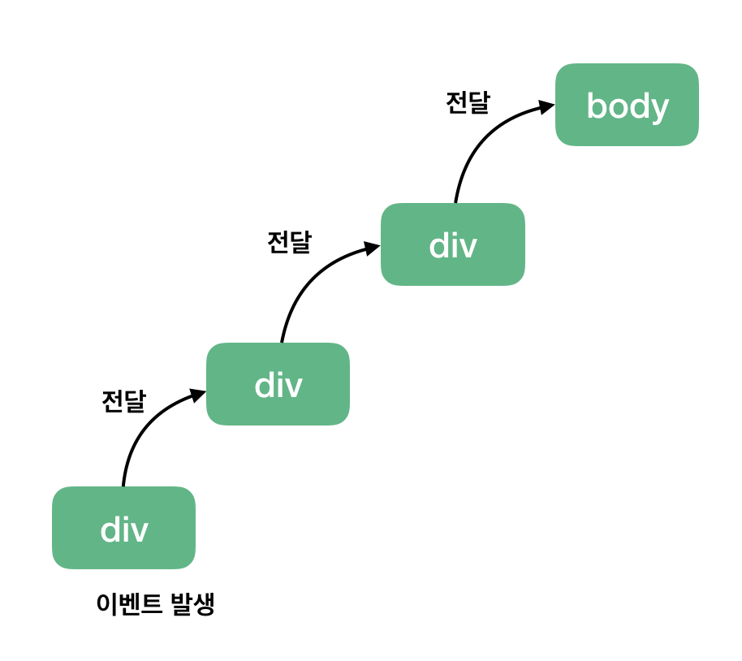
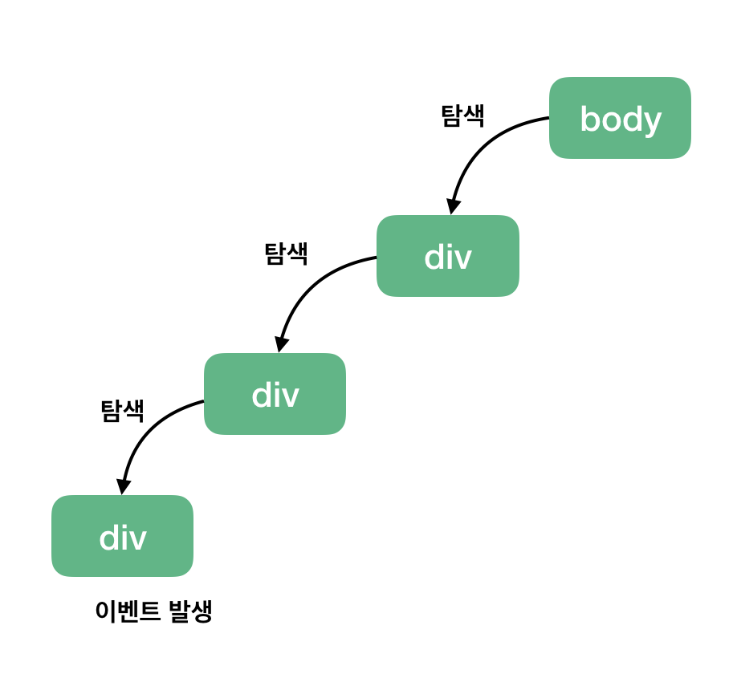

# 예상 면접 질문 - JAVASCRIPT

---
<p align="center">

</p>

---

<br>

### 자바스크립트 장단점
<details>
  <summary>Click me</summary>

장점
* 자바스크립트(JavaScript)는 컴파일 과정이 따로 필요가 없으며 바로 화면에 적용이 가능하다.
* 자바스크립트(JavaScript)는 인터프리터 언어로서 동적이며 타입을 명시할 필요가 없다.
* 자바스크립트(JavaScript)는 객체 기반의 스크립트 언어다.

단점
* 어느 날 브라우저의 정책이 변경될 경우 쓸모 없는 언어가 될 수 있다.
* 브라우저 상에 소스가 노출되어서 보안에 취약하며 신경을 많이 써야한다.
* 한정된 객체와 객체 함수를 제공한다.

</details>

### 타입스크립트란
<details>
  <summary>Click me</summary>

TypeScript는 MS에 의해 개발/관리되고 있는 오픈소스 프로그래밍 언어이다.
* Typescript는 동적타입언어인 Javascript의 약점을 보완하기 위해서 타입을 지정해주는 것이다.
* 타입이 필요한 이유는 결론은 메모리를 절약하기 위해서이다. 메모리에 저장된 것을 읽어들일때, 값을 메모리에 저장할때, 값이저장되어있는 것을 참조할때의 크기들을 알아야 하기 때문이다.
* 또한, 에러를 잡기가 쉬워지고, 다른 동료와 협업 할때 코드의 예측도 가능해지고, 코드에디터의 도움을 더 받을 수 있다.
* 리액트의 경우 (브라우저는 javascript밖에 모르기떄문에) tsx파일을 javascript로 변환하는 트랜스파일링이 필요하다. 이때 변환하는 과정에서 에러를 잡을 수 가있다. 런타임에 오류를 잡는 것보다 훨~~좋다!
* 또한, Babel을 안써도 된다.
* 자바스크립트 예전 버전 호환성 안 맞는 걸 맞게 해주는 맞게 해준다

</details>

<br>

### Babel이란?
<details>
  <summary>Click me</summary>

트랜스파일러이다.

컴파일은 한 언어로 작성된 소스 코드를 다른 언어로 바꾸는것(C-> 어셈블리어)이다.

트랜스파일러는 한언어로 작성된 소스코드를 비슷한 수준의 추상화를 가진 다른 언어로 변환하는 것이다.

(C++>C, ES6->ES5)

</details>

<br>


### 데이터 타입
<details>
  <summary>Click me</summary>

**원시 타입(=원시값)** : 단순한 데이터. 실제값을 가짐.
* number
* string
* boolean
* null
* undefined
* symbol (ES6에 추가됨)

**객체 타입(=참조값)** : 실제 값이 아니라 값의 주소를 참조하여 연산.
* object
* array
* function 등

</details>

<br>

### null vs undefined 차이점
<details>
  <summary>Click me</summary>

* 기본적으로 둘다 값이 없음을 나타낸다.
* undefiend는 데이터 타입이자 값을 나타냄.  정의되지 않은 것
* null은 명시적으로 값이 비어있음을 나타내는데 사용
* undefined는 변수를 선언만 한더라도 할당되지만, null은 변수를 선언한 후에 null로 값을 바꾼다.
* undefined는 선언만 되어 있고 값은 없는 상태를 말하며, null은 자료형이 객체이며 빈 값을 의미한다.

</details>

<br>

### 데이터 형 변환
<details>
  <summary>Click me</summary>

함수와 연산자에 전달되는 값은 대부분 적절한 자료형으로 자동 변환됨.

</details>

<br>

### 불변성을 유지하기 위해선
<details>
  <summary>Click me</summary>

**불변성** : 프로그래밍에서 데이터의 원본이 훼손되는 것을 막는 것을 의미한다.
* 이름 불변하게 하는 법 : var 대신 const 사용
* 값을 불변하게 하는 법 : 원시형 타입은 그 값 자체므로, 불변함. 객체는 같은 객체라도 속성 값을 바꿀 수 있어 가변.
  * ⇒ 객체를 불변하게 만드는 법 : object.assign, object.freeze, Nested object, 불변 함수

</details>

<br>

### Prototype (프로토타입)
<details>
  <summary>Click me</summary>

자바스크립트에 class 대신 존재하는 개념. 객체를 상속하기 위해서 프로토타입이라는 방식을 사용한다.
* 자바스크립트는 프로토타입을 기반으로 상속을 구현하여 불필요한 중복을 제거(중복 제거 방법은 기존의 코드를 재사용하는것!!)즉, 생성자 함수가 생성할 모든 인스턴스가 공통적으로 사용할 프로퍼티나 메소드를 프로토타입에 미리 구현해 놓음으로써 또 구현하는것이 아니라 상위(부모) 객체인 프로토타입의 자산을 공유하여 사용할 수 있다.proto 접근자 프로퍼티로 자신의 프로토타입, 즉 Prototype 내부슬롯에 접근 할 수 있음.
* 프로토타입체인이란?
  * 객체의 프로퍼티에 접근하려고 할때 객체에 접근하려는 프로퍼티가 없으면, __proto__접근자 프로퍼티가 가리키는 링크를 따라 자신의 부모역할을 하는 프로토타입의 프로퍼티를 순차적으로 검색한다. 프로로타입체인의 최상위 객체는 Object.prototype이다. 이 객체의 프로퍼티와 메소드는 모든 객체에게 상속된다.prototype 프로퍼티 는 생성자함수가 생성할 인스턴스의 프로토타입을 가르킨다.

</details>

<br>

### var, let, cont 차이
<details>
  <summary>Click me</summary>

<https://backstreet-programmer.tistory.com/76>

**var**: 중복 선언 가능, 재할당 가능
* 변수 선언을 여러 번해도 에러없이 각기 다른 값이 출력될 수 있습니다.
* 이는 필요할 때 마다 변수를 사용할 수 있다는(편리하다는) 장점이 될 수 도 있지만, 같은 이름의 변수명을 남용하는 문제를 야기할 가능성이 높아지기에 단점이 더 크다고 할 수 있습니다. 이를 보완하기 위해 ES6부터 let, const가 추가되었다.

**let**: 중복 선언 불가능, 재할당 가능
* let은 변수의 재할당은 가능하지만 var처럼 재 선언은 되지 않습니다. 실제로 재선언 후 크롬 개발자도구에서 확인해보면, 아래 이미지와 같은 에러 문구를 확인하실 수 있습니다.

**const**: 중복 선언 불가능, 재할당 불가능. (단, 객체는 재할당이 가능하다.)
* const의 경우 constant(상수)의 의미 그대로 한 번만 선언하고 또 값을 재할당을 통해 바꿀 수도 없습니다.

재할당이 필요없는 경우, const를 사용해 불필요한 변수의 재사용을 방지하고, 재할당이 필요한 경우 let을 사용하는 것이 좋음.

</details>

<br>

### Hoisting (호이스팅)
<details>
  <summary>Click me</summary>

호이스팅이란 변수를 선언하고 초기화 했을때 선언부분이 최상단으로 끌어올려지는 현상이다. 즉, 변수나 함수가 어디서 선언이 되든지간에 최상단에 선언을 끌어 올려주는 것이다.
* 코드에 선언된 변수 및 함수를 코드의 상단으로 끌어올려서 해당 변수 및 함수 유효 범위의 최상단에 선언하는 것을 말한다. 실제 코드가 끌어올려지는 것은 아니며, 자바스크립트 parser 내부적으로 끌어올려서 처리한다. 실제 메모리에는 변화가 없다.
* 호이스팅은 var 변수의 선언과 함수 선언문에서만 일어난다. let, const 변수 선언 시 호이스팅이 발생하지 않는다.
* 어디에 서나 함수나 변수를 호출할 수 있다.

</details>

<br>

### es6 문법 특징과 차이
<details>
  <summary>Click me</summary>

* 화살표 함수 : 함수 선언법이 좀 더 간단해졌다.
* 템플릿 리터럴 : ES5에서는 변수를 문자열과 같이 쓰려면 하나 씩 문자열을 지정해야 하지만 백틱을 사용해 여러 줄의 문자열과 값을 간단하게 나타낸다.
* 기본 매개변수 : ES5에서는 인자가 없거나 언디파인드인 경우에 기본값을 설정해 놓아야 한다. ES6에서는 기본 매개변수를 지정하고 없는 경우에는 지정한 기본값을 인자로 전달 해야한다.
* 비구조화 할당 : 배열이나 객체의 요소를 해체하여 따로 변수로 추출할 수 있다.
* 모듈 : ES6 부터는 import/export 로 모듈을 관리할 수 있다. 로드 모듈은 import/ from으로 설정하고 아웃풋 모듈은 export default class를 설정하면 된다.

</details>

<br>

### this란?
<details>
  <summary>Click me</summary>

* 크게 전역에서 사용할 때와 함수 안에서 사용할 때로 나눌 수 있다.
* this는 자신이 속한 객체 또는 자신이 생성할 인스턴스를 가리키는 자기 참조 변수(self-reference variable)이다.
* this를 통해 자신이 속한 객체 또는 자신이 생성할 인스턴스의 프로퍼티나 메서드를 참조할 수 있다.
* this는 자바스크립트 엔진에 의해 암묵적으로 생성된다.
* this는 코드 어디서든 참조할 수 있다. 단, this는 객체의 프로퍼티나 메서드를 참조하기 위한 자기 참조 변수이므로 일반적으로 객체의 메서드 내부 또는 생성자 함수 내부에서만 의미가 있다.
* 함수를 호출하면 인자와 this가 암묵적으로 함수 내부에 전달된다.
* 함수 내부에서 인자를 지역 변수처럼 사용할 수 있는 것처럼, this도 지역 변수처럼 사용할 수 있다. 단, this가 가리키는 값인 this 바인딩은 함수 호출 방식에 의해 동적으로 결정된다.
* 단독으로 쓸 경우 전역(window) 객체를 가리킨다.
* 함수 안에서 쓸 경우 this는 함수의 주인에게 바인딩 된다.
* 메서드 안에서 쓸 경우 해당 메서드를 호출한 객체로 바인딩 되어 메소드를 소유하고 있는 객체를 가리킨다.
* 이벤트 핸들러 안에서 쓴 경우 이벤트를 받는 HTML 요소를 가리킨다.
* 생성자 안에서 쓴 경우 새롭게 만들어진 객체를 가리킨다.

</details>

<br>

### jQuery 메서드 중 attr(), prop() 차이
<details>
  <summary>Click me</summary>

태그들의 속성값을 정의하거나 가져오기 위해 사용한다.
* attr() : html 의 속성(attribute)을 다룬다.
* prop() : javascript 프로퍼티(property)를 다룬다.

</details>

<br>

### 화살표 함수와 일반 함수의 this 차이
<details>
  <summary>Click me</summary>

<https://poiemaweb.com/es6-arrow-function>

자바스크립트의 내부함수는 일반 함수, 메소드, 콜백함수 어디에서 선언되었든지 this는 전역객체를 가르킨다.

일반함수의 this는 window(전역)을 가르키며, 화살표 함수의 this는 언제나 상위스코프의 this를 가르킨다.

</details>

<br>

### Scope (스코프)
<details>
  <summary>Click me</summary>

<https://hanamon.kr/javascript-스코프와-변수선언키워드-차이점/>

스코프(Scope)는 식별자(변수명, 함수명, 클래스명)의 유효범위를 뜻하며, 선언된 위치에 따라 유효범위가 달라진다. 전역(globe) 스코프와 지역(local) 스코프로 나뉜다. global은 전역에 선언되어 어디에 있든지 해당 변수에 접근 할 수 있고, local은 해당 지역에서만 접근할 수 있어 지역을 벗어난 곳에선 접근할 수 없다는 의미이다.
* 자바스크립트에서는 모든 코드 블록(if, for, while 등)이 지역 스코프를 만든다. = 블록 레벨 스코프
* 하지만 var로 선언된 변수는 오로지 함수의 코드 블록만 지역 스코프로 인정한다. = 함수 레벨 스코프

</details>

<br>

### 객체 지향
<details>
  <summary>Click me</summary>

필요한 데이터를 추상화 시켜 상태와 행위를 가진 객체

</details>

<br>

### Closure (클로저)
<details>
  <summary>Click me</summary>

<https://hanamon.kr/javascript-클로저/>

외부 함수에 접근할 수 있는 내부 함수 혹은 이러한 원리를 일컫는 용어인데 스코프에 따라서 내부 함수의 범위에서는 외부 함수 범위에 있는 변수에 접근이 가능하지만 그 반대는 실현이 불가능하다는 개념이다.
* 클로저는 함수와 함수가 선언된 어휘적 환경(Lexical environment) 의 조합이다.
* 함수가 속한 렉시컬 스코프를 기억하여 함수가 렉시컬 스코프 밖에서 실행될 때에도 이 스코프에 접근할 수 있는데, 이 때 함수가 접근할 수 있는 렉시컬 스코프를 클로저라고 부른다.
* 외부 함수는 외부 함수의 지역변수를 사용하는 내부 함수가 소멸될 때까지 소멸되지 않는다. 예를 들어 한 함수 안에 다른 함수가 있다면 그 안의 함수는 바깥에 정의해 놓은 변수를 사용할 수 있지만 그 반대는 가능하지 않다.
* 즉, 반환된 내부함수가 자신이 선언 되었을때의 환경인 스코프를 기억하여 자신이 선언 되었을때의 환경 밖에서 호출 되어도 그 환경에 접근할 수 있는 함수, 자신이 생성될때의 환경을 기억하는 함수이다.
* 사용하는 이유
  * 현재 상태를 기억하고 변경된 최신 상태를 유지하기 위해
  * 전역 변수의 사용을 억제 하기위해
  * 정보를 은닉하기 위해

</details>

<br>

### 프로세스
<details>
  <summary>Click me</summary>

운영체제에서 실행 중인 프로그램.

</details>

<br>

### 스레드
<details>
  <summary>Click me</summary>

프로세스 안에서 한 가지 작업을 실행하기 위해 순차적으로 실행되는 흐름.

한 번에 하나의 작업만 수행할 수 있다.

</details>

<br>

### 싱글 스레드
<details>
  <summary>Click me</summary>

하나의 프로그램에서 하나의 코드만 실행할 수 있다는 뜻. (동기적으로 처리) 동기적으로 처리되어 블로킹을 만든다.

자바스크립트는 싱글 스레드이므로 동기적인 언어. so 한 번에 한 가지 일 밖에 못함. 그러나 비동기적인 처리도 할 수 있다. ⇒ setTimeout, 이벤트 리스너, ajax 함수

</details>

<br>

### 콜백 함수 / 재귀 함수 차이
<details>
  <summary>Click me</summary>

**재귀함수** : 함수가 자기 자신을 호출하는 것. 즉, 함수 안에서 자기 자신을 다시 호출하여 작업을 수행하는 것이다.
```javascript
<script>
function fac(n){
    if(n === 1) return 1;
    return n * fac(n-1);
}
</script>

// fac(4) // 결과 24
```
* 장점 : 직관적인 코드로 가독성을 높여준다.
* 단점 : 재귀 호출을 이중으로 사용하면 함수 호출 횟수가 엄청나게 증가하여 연산이 끝나지 않는다 / 메모리를 많이 사용한다.

**콜백함수** : 파라미터로 전달된 함수로, 함수의 내부에서 실행하는 함수이다. 즉, CallBack 함수란 다른 함수의 인자로 넘겨지는 함수를 말한다. 개발자는 단지 함수를 등록하기만 하고, 어떤 이벤트가 발생했거나 특정 시점에 도달했을 때 시스템에서 호출하는 함수를 말한다.
```javascript
<button id="button1" onclick="button1_click();">버튼1</button>
<script>
	function button1_click() {
		alert("버튼1을 누르셨습니다.");
	}
</script>
```
* 대표적인 예로, 이벤트 핸들러 처리가 있다. 클릭 이벤트가 발생했을 때 이벤트 핸들러가 콜백함수를 호출한다.

</details>

<br>

### 콜백 지옥
<details>
  <summary>Click me</summary>

함수가 많을수록 작성하기 어렵고 가독성이 떨어진다.

콜백 지옥을 해결하기 위해서는 Promise를 사용한다.

</details>

<br>

### (비동기) Promise / 콜백 지옥
<details>
  <summary>Click me</summary>

둘 다 자바스크립트에서 비동기처리를 위해서 사용되는 패턴이며, Callback 같은 경우 함수의 처리 순서를 보장하기 위해서 함수를 중첩하게 사용되는 경우가 발생해 콜백헬이 발생하는 단점과 에러처리가 힘들다라는 단점이 있다. 그래서 나온게 Promise이며 ES6부터 정식 채택되어 사용중이다.

**callback** : 함수 안에 함수 넣어 순서 정함.
* 비동기 로직 결과값을 처리하기 위해서 callback안에서만 처리해야한다. callback밖에선 비동기에서 온 값을 알수가 없다. 하지만 promise를 사용하면 비동기에서 온 값이 promise 객체에 저장되기 때문에 코드 작성이 용이하다.

**promise** : .then으로 함수 실행 순서를 정할 수 있다. 함수가 많아지면 역시 가독성 떨어짐.
* 비동기처리만을 위해 만들어져서 resolve나 reject함수들이 잘 정의되어 있다. callback pattern은 자유도가 높지만 template이 없어서 코드가 복잡하고 에러처리같은 작업이 어렵다.
* 언젠가 완료가 되는 작업의 결과값을 담음.

</details>

<br>

### (비동기) Promise란?
<details>
  <summary>Click me</summary>

<https://velog.io/@josworks27/Promise-란>

</details>

<br>

### (비동기) ajax란?
<details>
  <summary>Click me</summary>

서버와 비동기적으로 데이터를 주고받는 자바스크립트 기술. 새로 고침 없이 GET 요청하는 방법.

자바스크립트를 이용해 비동기적으로 서버와 브라우저가 데이터를 교환할 수 있는 통신 방식. 보통은 서버로부터 웹페이지가 반환되면 전체를 갱신해야하는데 AJAX를 사용하면, 페이지 일부만을 갱신하고도 동일한 효과를 볼 수 있다. 즉, 갱신이 필요한 부분만 로드하여 갱신하면 되므로 빠르고, 부드러운 화면효과를 기대할 수 있다.

그래서 웹 앱에서 부분적으로 데이터 불러올 때 비동기를 써서 새로 고침 없이 실시간으로 불러온다.

(비동기) async, await

</details>

<br>

### 함수 선언식 / 표현식 차이
<details>
  <summary>Click me</summary>

주요 차이점은, 호이스팅에서 차이가 발생한다.

**함수 선언식** - 일반적인 함수 선언 형태
* 함수 전체를 호이스팅 합니다. 정의된 범위의 맨 위로 호이스팅되서 함수 선언 전에 함수를 사용할 수 있다는 것입니다.

**함수 표현식** - 변수에 담아 선언
* 별도의 변수에 할당하게 되는데, 변수는 선언부와 할당부를 나누어 호이스팅 하게 됩니다. 선언부만 호이스팅하게 됩니다.

</details>

<br>

### 이벤트 버블링 / 이벤트 캡쳐링
<details>
  <summary>Click me</summary>

**이벤트 버블링 (Event Bubbling)**
* 한 요소에 이벤트가 발생하면 이 요소에 할당된 핸들러가 동작하고, 이어서 부모 요소의 핸들러가 동작하고 최상단의 부모 요소를 만날 때까지 반복되면서 핸들러가 동작하는 현상이다.
* 특정 요소에 이벤트 발생 시, 해당 이벤트가 상위 요소(tree 구조에서)에도 적용된다.
* ex) div > div > div 일 때, 최하위 div에 이벤트를 주면 최하위부터 상위까지 순차적으로 이벤트 적용.
*https://joshua1988.github.io/web-development/javascript/event-propagation-delegation/*


**이벤트 캡쳐링 (Event Capturing)**
* 버블링과는 반대로 최상위 태그에서 해당 태그를 찾아 내려간다.
* 반대 방향. 사용하려면 addEventListern() API 옵션 객체에 capture: true 설정.
* 이벤트 전파 막는 방법 : stopPropagation()
*https://joshua1988.github.io/web-development/javascript/event-propagation-delegation/*

</details>

<br>

### Event Delegation (이벤트 위임)
<details>
  <summary>Click me</summary>

하위 요소에 각각 이벤트를 붙이지 않고 상위 요소에서 하위 요소의 이벤트를 제어하는 방식

</details>

<br>

### 렉시컬 환경
<details>
  <summary>Click me</summary>

block, function, script를 실행하기에 앞서 생성되는 특별한 객체. 실행할 스코프 범위 안에 있는 변수와 함수를 프로퍼티로 저장하는 객체.

</details>

<br>

### 프로퍼티
<details>
  <summary>Click me</summary>

객체 내부의 속성 객체는 프로퍼티로 구성된다. 프로퍼티는 "key(키)" : "value(값)"  의 형식으로 객체 안의 콤마(쉼표 , )로 구분되어 할당된다.

</details>

<br>

### Stack이 코드 실행할 때 queue에 미뤄두는 것
<details>
  <summary>Click me</summary>

Ajax 요청 코드, 이벤트 리스너, setTimeout 등

단, stack이 비었을 때 queue가 하나씩 올려보냄.

so 사이트가 느려지지 않게 하려면 stack이나 queue를 바쁘게 하면 안됨. stack이 비워져야 queue가 코드들을 하나씩 올려보내니까.

</details>

<br>

### 얕은 복사 / 깊은 복사
<details>
  <summary>Click me</summary>

**깊은 복사**(Deep Copy)는 '실제 값'을 새로운 메모리 공간에 복사하는 것을 의미하며, 얕은 복사 (Shallow Copy)는 '주소 값'을 복사한다는 의미입니다. 얕은 복사의 경우 주소 값을 복사 하기 때문에, 참조하고 있는 실제값은 같습니다.

**깊은 복사**
* 데이터 자체를 통째로 복사한다.
* 복사된 두 객체는 완전히 독립적인 메모리를 차지한다.
* value type의 객체들은 깊은 복사를 하게 된다.
* 깊은 복사 된 객체는 객체 안에 객체가 있을 경우에도 원본과의 참조가 완전히 끊어진 객체를 말한다.

**얕은 복사**
* 얕은 복사는 아주 최소한만 복사를 한다. 값을 복사한다 하더라도, 인스턴스가 메모리에 새로 생성되지 않는다.
* 객체 안에 객체가 있을 경우 한 개의 객체라도 원본 객체를 참조하고 있다면 이를 얕은 복사 라고 한다.

</details>

<br>

### 동기 / 비동기
<details>
  <summary>Click me</summary>

<https://miracleground.tistory.com/165>

**동기 (Synchronous)** : 요청과 결과가 동시에 일어난다는 약속.
* 동시에 똑같이 진행된다는 뜻 = 직렬
* 현재 실행중인 코드를 완료하고 다음 코드를 처리하는 방식. (A 작업 다 끝나야 B 가능)
* 요청에 대한 응답이 돌아와야 다음 동작을 수행할 수 있다.
* 대표적인 동기의 예로는 은행이 있다. 송금을 하고 금액을 받는 상황은 동시에 이루어져야 하기 때문이다.(한 쪽에서는 돈을 보냈지만 다른 한 쪽에서는 돈을 기다리는 상황이 생긴다면 이를 악용하는 사례들이 많을 것이다)
* 장점 : 설계가 간단, 직관적
* 단점 : 결과가 주어질 때까지 기다려야 한다. 결과가 나오지 않는다면 뒤의 작업을 진행할 수 없고 대기해야 한다.

**비동기 (Asynchronous)** : 요청과 결과가 동시에 일어나지 않을 거라는 약속.
* 동시에 똑같이 진행되지 않는다는 뜻 = 병렬
* 현재 코드의 진행여부에 상관없이 다음 코드를 실행하는 방식. (A 작업 시작할 때, B 작업 실행 가능)
* 응답이 상태와 상관없이 다음 동작 수행 가능.
* 대표적인 비동기의 예로는 시험이 있다. 학생은 시험지를 풀고 채점을 기다리면 되고, 선생은 채점을 하여 학생에게 건네기만 하면 된다. 진행 타이밍은 중요하지 않다.
* 장점 : 결과가 주어질 때까지 시간이 걸리는 동안 다른 작업을 할 수 있다. 결과가 나오지 않아도 기다리지 않고 자원을 효율적으로 사용이 가능하다.
* 단점 : 설계가 복잡하다.

**예 1)** 커피를 주문하는 상황을 생각해보자. 한 사람이 커피를 주문하고, 주문한 커피를 제공한 후, 다음 사람의 주문을 받는건동기적 방식이라고 볼 수 있다. 반대로 모든 사람의 주문을 한번에 받고, 커피가 완성되는 대로 제공하는건 비동기적 방식이다.

**예 2)** 비동기 방식 예제를 통해서 블록과 논블록의 차이를 간략하게 설명하자면, 학생이 시험지를 선생에게 건넨 후 가만히 앉아 채점이 끝나서 시험지를 돌려받기만을 기다린다면 학생은 블록 상태, 하지만 채점이 완료되었다는 전송을 받기 전까지 다른 일을 하게 되면 학생의 사애는 논블록 상태

</details>

<br>
